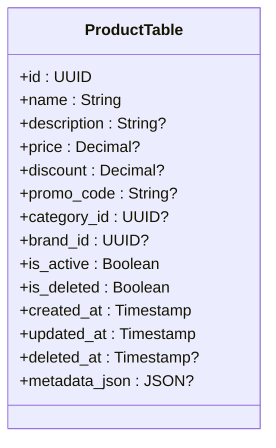
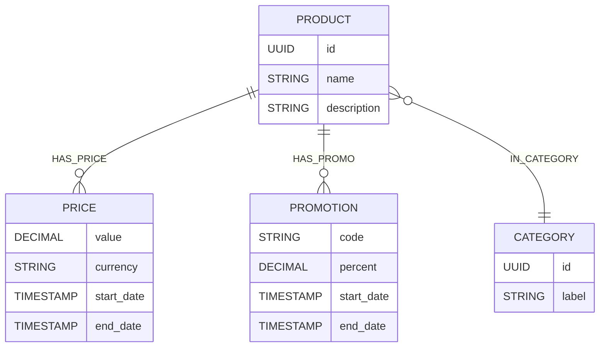
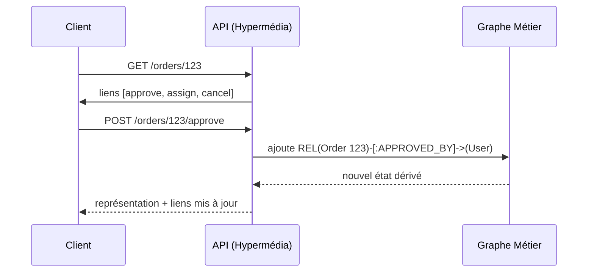
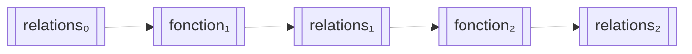

# Des Entités aux Relations : une Modélisation plus Naturelle du Métier

> *TL;DR* : Modéliser les données comme un graphe de relations fonctionnelles, plutôt que comme une compilation d’attributs dans des tables fourre-tout.
{: .prompt-tip }

## Introduction

La modélisation de données est au cœur de tout système d’information, mais les approches classiques finissent souvent par rigidifier le métier.  
Nous allons examiner une autre voie : déplacer la variabilité vers les **relations** plutôt que dans les entités, pour obtenir des modèles plus naturels, évolutifs et fidèles à la réalité métier.  
Cet article part du constat du caractère fourre-tout des modèles relationnels et montre comment une approche inspirée des graphes et du paradigme fonctionnel permet de les rendre vivants à nouveau.  

> Déplacez la variabilité dans les **relations** (liens “chauds”), gardez les entités **stables** (nœuds “froids”), et laissez l’API hypermédia refléter ces liens.
{: .prompt-info }

---

## Le Constat du Terrain : Un Réflexe Data-First Dominant

Un projet logiciel débute souvent par la création de tables de données.

On commence souvent un projet avec quelques tables, et lorsqu’un besoin émerge, la question réflexe est :  

> Qu’est-ce qu’on ajoute dans la table `xxx` ?  
> On va ajouter un booléen `is_xxx` pour la feature, rajouter une 46e valeur à l'enum `status`, ou créer un `JSON` pour stocker les données dynamiques.
{: .prompt-danger }

Ce réflexe *data-first* est intuitif : il donne un point de départ concret. Pourtant, il amène à penser les problèmes à travers la structure, non la signification.  

À long terme, cette approche crée un écart entre le métier et le modèle. Les tables deviennent des archives de compromis : un champ ajouté pour un cas temporaire, un booléen pour une exception, un JSON pour un besoin pressant.  
Le métier n'est plus isolé, mais dilué dans une mer de colonnes et de flags.
Le résultat est une structure qui se noie, où chaque ajout complexifie le système existant au lieu de le clarifier.  

### Conséquence pour les équipes agiles

Dans le contexte d’équipes agiles, on procède souvent par itérations rapides.  
Chaque sprint apporte son lot de changements, souvent urgents, et la pression pour livrer pousse à des solutions rapides.  
Le modèle de données, censé être stable, devient un champ de bataille : on ajoute des colonnes, on modifie des types, on crée des tables temporaires.
Chaque changement devient une opération lourde : migration, tests, refactorings d’ORM.  
Cette dette structurelle devient un frein à la souplesse, un paradoxe pour un processus agile.

> Le propos n'est pas de rejeter le principe de l'agilité et l'approche itérative, mais de souligner que la structure des données doit être pensée pour accompagner cette agilité, pas la freiner.
{: .prompt-info }

---

## Les tables fourre-tout : un legacy qui s’installe

Dans la plupart des systèmes matures, certaines tables deviennent monstrueuses : **Product**, **Customer**, **Order**.  
Elles débutent simples, puis gonflent avec le temps, jusqu’à accumuler plusieurs dizaines de colonnes, souvent à moitié nulles.

### Symptômes typiques

- **Nullabilité excessive** : des champs optionnels partout, synonymes d’incertitude.  
- **Colonnes contradictoires** : `is_deleted` et `active`, coexistant sans règle claire.  
- **Objets massifs** : entités devenant des sacs de champs optionnels.  
- **Couplage diffus** : chaque évolution risque d’en casser d’autres.

### Répercussions sur le code

Le code s’alourdit à mesure que le modèle se déforme : conditions `if not null` omniprésentes, ORM surchargés, DTOs volumineux.  
La maintenance devient un travail d’archéologie. Les nouveaux développeurs mettent des semaines à comprendre les relations cachées entre colonnes et statuts.  

L'introduction de nouvelles fonctionnalités devient un défi : chaque ajout nécessite peut potentiellement provoquer des effets de bord inattendus. On doit alors se fier à l'expérience et à la mémoire collective, plutôt qu'à une structure claire et cohérente.

Face à cette complexité croissante, renforcer encore la structure ne suffit plus.  
Il faut **changer de perspective** : ne plus penser les systèmes comme des ensembles d’objets figés, mais comme des réseaux de relations vivantes.

> Ne comptez pas sur la documentation pour compenser un modèle confus : elle est toujours obsolète ou incomplète.
{: .prompt-warning }

---

## Alternative : modéliser en graphe

Les bases graphiques, comme **Neo4j** ou **pg_graph**, proposent une approche où la **relation** est un first-class citizen, au même titre que les tables des SGBD classiques.



*Représentation d'une table **Legacy** surchargée : nombreux champs optionnels, sémantique diffuse et couplage fort.*

Ainsi, au lieu d’une table `Product` avec 50 colonnes, on conserve un nœud `Product` simple, lié à des faits par des relations :  



*Représentation ER : nœud `PRODUCT` minimal, faits et contextes portés par des relations.*

> On peut tout aussi implémenter cette approche sur une base relationnelle classique, en utilisant des tables pour les nœuds et des tables de jointure pour les relations, l'utilisation d'une base graphique n'étant pas une obligation pour adopter cette modélisation.
L'avantage principal réside en ce qu'elle apporte un cadre de conception plus structuré pour séparer les données stables des données dynamiques.
{: .prompt-info }

### Le “non-lien” comme sémantique

L’absence d’un lien devient une information : *pas de promo active*, *pas de prix défini pour ce canal*.  
Cette sémantique explicite élimine la notion de `NULL` et rend la lecture métier plus directe.

### Lecture naturelle

Le graphe reflète la pensée humaine : on explore les relations, on contextualise les faits.  
Une requête métier devient un parcours logique :  
> “Quels produits ont une promotion active dans la catégorie ‘été’ et un prix inférieur à 50 € ?”

| Sujet | Tables fourre‑tout (SQL) | Graphe relationnel (GDD) |
|---|---|---|
| Variabilité | Champs ajoutés, `NULL`/flags | Nouvelles **relations** versionnées |
| Lecture métier | Colonnes à croiser | Parcours de liens explicites |
| Historique | Overwrite ou colonnes `_at` | **Immutabilité** : nouveaux liens horodatés |
| Couplage | Elévé (DTO/ORM massifs) | Localisé (nœuds stables, liens spécialisés) |
| Hypermédia | Endpoints fixes | Liens/action **alignés** sur le graphe |

### Une approche intuitive avant d’être technologique

### Principe de stabilité et chaleur de la donnée

Mais penser en graphe ne suffit pas : encore faut-il savoir **où placer la variabilité**.  
C’est ici qu’intervient le principe de stabilité, ou de “chaleur” de la donnée, qui distingue les éléments structurels des éléments dynamiques du domaine.

Toutes les données n'ont pas la même nature, ni la même "chaleur".  
Certaines sont **stables**, presque structurelles : elles décrivent ce qu'une entité *est*.  
D'autres sont **dynamiques**, évolutives : elles décrivent ce qu'une entité *fait*, ou ce qui lui *arrive*.  

Dans une approche Graph-Driven, ce principe est fondamental :  
on ne traite pas de la même manière les attributs froids et les faits chauds.

- Les **données froides** (ou stables) sont celles dont la valeur change rarement : un nom, une dimension, un type.  
  Elles appartiennent naturellement au **nœud**.  
  Elles représentent l'identité ou les propriétés essentielles de l'entité.  

- Les **données chaudes** (ou mutables) sont celles qui reflètent un état, une relation, un événement.  
  Elles doivent être placées dans les **relations**, car ce sont elles qui racontent l'évolution du métier.  

> Règle de pouce : si une information **prend sens par le contexte** (temps, canal, contrainte), c’est une **relation**.
{: .prompt-info }

Ce principe de stabilité aide à décider ce qui doit être représenté comme relation :  
> Est-ce que cette donnée peut changer indépendamment de l'entité ?  
> Est-elle contextuelle ou temporelle ?  
> A-t-elle un sens sans sa relation à d'autres éléments ?  

Si la réponse est oui, alors elle mérite d'exister comme relation.  
Sinon, elle reste une propriété du nœud.

Ce principe introduit une hiérarchie naturelle entre les couches du graphe :

- les **nœuds froids**, représentant l'essence des choses ;
- les **liens chauds**, représentant la vie et les interactions du domaine.

Cette distinction permet d'éviter la sur-généralisation, en gardant le graphe expressif sans le surcharger.  
Elle introduit aussi une dimension temporelle implicite : plus la donnée est "chaude", plus elle est susceptible d'évoluer ou d'être historisée.

### Les relations et la navigation hypermédia

Dans un système fondé sur le GDD, la **relation** devient le candidat naturel pour porter les **liens hypermédia** (hypermédia ou tout autre protocole à base de liens).  
En effet, la relation est déjà une **expression de contexte dynamique** : elle relie deux entités à un instant donné, sous une sémantique précise (ex. `HAS_STATUS`, `IS_MEMBER_OF`, `CAN_ACCESS`).  

Cela correspond exactement à ce que l'hypermédia cherche à représenter :  
des **liens contextualisés** entre ressources, porteurs d’intention et de signification.

### Les relations comme actions métier

Autrement dit :

- un **nœud** représente une ressource stable,
- une **relation** représente une action ou un état possible,
- et l’**hypermédia** n’est rien d’autre qu’une matérialisation navigable de ces relations.

Dans cette perspective, le GDD fournit une **base conceptuelle unifiée** entre le modèle de données et le modèle de communication.  
Les liens que manipule l’API ne sont plus de simples métadonnées techniques, mais le **reflet direct du graphe métier**.

Ainsi, une architecture hypermédia n’est pas une surcouche, mais une **extension naturelle du graphe** :  
le client ne navigue plus dans des endpoints, mais dans les relations mêmes qui font vivre le domaine.



On peut affiner cette idée en distinguant deux natures de navigation dans l’hypermédia :

- Les **modifications d’état** concernent les **données froides**.  
  Elles correspondent souvent à ce que l’on trouve dans les modèles REST classiques : des opérations de mise à jour ou de remplacement de la ressource (`PUT`, `PATCH`, `DELETE`).  
  Elles visent à modifier la représentation de l’entité elle-même, donc sa partie stable.

- Les **relations**, quant à elles, incarnent des **actions sur la ressource**.  
  Ce sont les véritables **méthodes métier** : elles ne modifient pas directement l’objet, mais expriment une transition ou une interaction (`/approve`, `/assign`, `/cancel`, etc.).  
  Dans cette logique, la relation devient l’équivalent conceptuel d’une **méthode hypermédia**, liant état courant et état possible.

Ainsi, la séparation entre données froides (état) et relations (actions) rejoint celle que le GDD opère dans le modèle :  
le graphe ne se contente plus de décrire le monde, il **décrit comment le monde peut évoluer**.

Le **Graph-Driven Design** n’implique pas nécessairement l’usage d’une base orientée graphe.  
On peut très bien concevoir une architecture **graph/relationnelle** au-dessus d’un SGBD classique (PostgreSQL, MariaDB, etc.) : tables pour les nœuds, tables pour les relations, vues matérialisées pour les parcours.  

Le véritable changement se situe au **niveau de la représentation mentale**.  
Dans un modèle pensé comme un graphe, on a naturellement tendance à :

- placer la **variabilité** dans les **relations** (les liens entre faits ou états)
- considérer les entités comme des **points stables** du domaine,  
- et faire **évoluer le système par ajout de liens**, plutôt que par mutation de champs.  

À l’inverse, dans une modélisation “classique”, on tend à **agréger des états** dans une même entité, créant des objets qui accumulent des champs mutables et dont la cohérence devient de plus en plus difficile à maintenir.

Cette différence de posture mentale a un impact majeur :  
elle conduit à **penser l’évolution du métier comme une succession de faits relationnels**, et non comme la modification d’un état unique et centralisé.  

---

## Extension Fonctionnelle : Le Métier comme Flux de Relations

En s’inspirant du paradigme fonctionnel, on peut voir le métier comme une **transformation de relations**.  
Chaque règle devient une fonction pure qui prend un ensemble de liens en entrée et en produit d’autres en sortie.

```
[relations₀] → fonction1 → [relations₁] → fonction2 → [relations₂]
```



Exemples :

- Le calcul d’un **prix effectif** combine `HAS_PRICE` et `HAS_PROMO`.
- La validation d’une commande dérive `IS_DELIVERABLE` à partir de `HAS_STOCK` et `HAS_ADDRESS`.

### Propriétés clés

- **Immutabilité** : on n’écrase pas l’état précédent, on ajoute un nouveau lien.  
- **Traçabilité** : chaque transformation devient un fait historisé.  
- **Testabilité** : une fonction métier devient testable isolément, car elle ne dépend que de ses entrées.

---

## Journalisation et Compatibilité

L’un des atouts majeurs du GDD est la **version des relations**.  
Chaque lien peut exister en plusieurs versions (`HAS_PRICE@v1`, `HAS_PRICE@v2`), représentant une évolution du métier sans rupture.

### Avantages

- **Rollback immédiat** : revenir à une version précédente sans migration de données.  
- **Canarisation** : plusieurs versions coexistent pour validation progressive.  
- **Évolution continue** : le modèle grandit sans effacer l’historique.

> Attention : évitez de multiplier les versions sans politique de **retrait** (TTL, vues de compatibilité).
{: .prompt-warning }

Cette approche rend possible une forme d’**agilité structurelle**, où l’évolution du métier se fait par addition, non par destruction.

---

## Cohabitation avec le DDD

Le **Domain-Driven Design (DDD)** a apporté un cadre précieux : recentrer le métier, isoler les invariants, parler un langage commun.  
Mais il suppose une certaine stabilité du domaine et une maturité d’équipe rarement réunies dans la réalité quotidienne.  

Les agrégats, censés être des frontières de cohérence, deviennent vite des mini-systèmes opaques.  
Le besoin de flexibilité pousse alors à les contourner : on rajoute des flags, des entités liées artificiellement, ou des états transitoires mal définis.

### Une tension entre idéal et pratique

Le DDD vise la rigueur, mais cette rigueur devient lourde quand le domaine évolue sans cesse.  
Le **GDD** ne cherche pas à le remplacer : il le prolonge, en déplaçant la cohérence de l’objet vers la **relation**.

Le **DDD** et le **GDD** ne s’opposent pas : ils répondent à deux moments différents du cycle de conception.

| Aspect | DDD | GDD |
|--------|-----|-----|
| Unité de modélisation | Agrégat / entité | Relation |
| Cohérence | Encapsulation | Structure et invariants globaux |
| Temporalité | Optionnelle | Native |
| Évolution | Refactoring | Versionnement |
| Auditabilité | Ajoutée | Naturelle |

Le DDD structure la pensée ; le GDD structure la donnée.  
L’un encapsule, l’autre expose. Ensemble, ils offrent une vision à la fois **rigoureuse et fluide** du métier.

---

## Le GDD dans un Environnement Microservices

Dans une architecture distribuée, chaque microservice gère un **sous-graphe** du système.  
Les **nœuds racines** (`Customer`, `Product`, `Order`) sont partagés, tandis que chaque service définit ses **relations spécialisées** (`pricing.*`, `fulfillment.*`, `marketing.*`).

### Bénéfices concrets

- **Découplage logique sans duplication de données**.  
- **Identité stable** : pas besoin de clés primaires inter-DB.  
- **Autonomie métier** : chaque équipe évolue son espace relationnel sans casser les autres.  
- **Cohérence systémique** : assurée par la structure et les invariants, pas par les transactions distribuées.

Le graphe devient ainsi un **socle commun** où chaque domaine ajoute sa couche sémantique.

---

## Conclusion

Le **Graph-Driven Design** ne remplace pas les modèles relationnels ni le DDD, il les **étend**.  
En plaçant les relations au centre :
- il libère la variabilité,
- il capture l’histoire métier,
- et il aligne la structure technique avec le langage des faits.

Dans un monde où les domaines évoluent vite, le GDD offre une voie plus naturelle :  
celle d’un système qui raconte son propre fonctionnement à travers ses relations.

