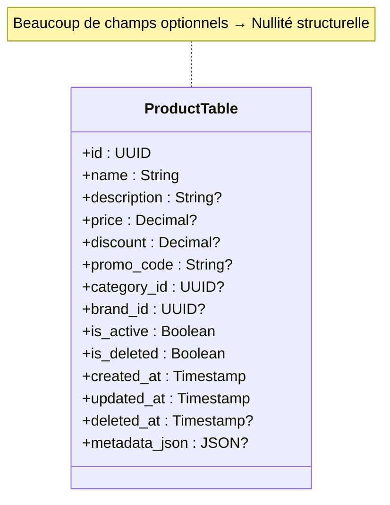
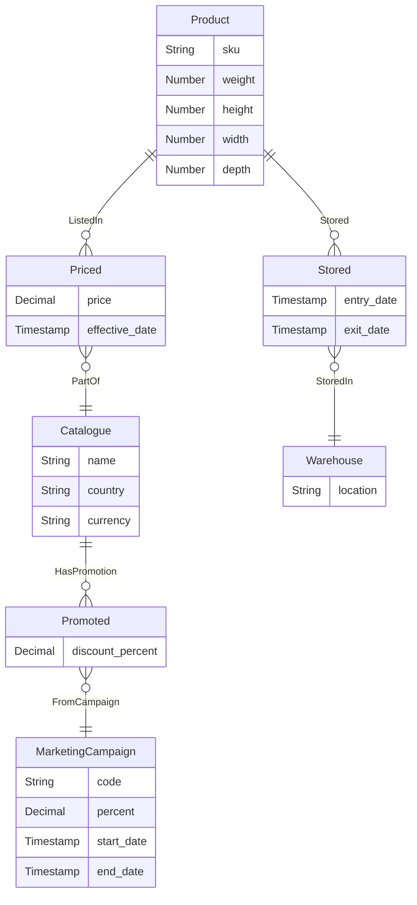
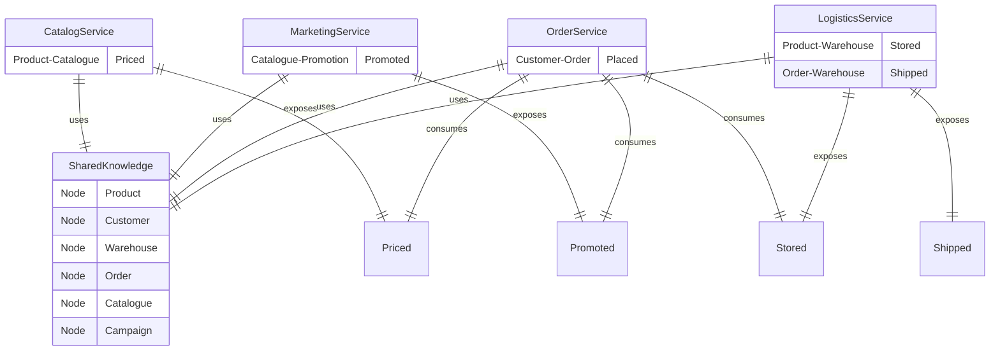

# Des entités aux relations : une modélisation plus naturelle du métier

Réaliser une ségrégation claire entre les données stables (nœuds) et les faits dynamiques (relations) pour capturer la variabilité métier de manière plus fluide et évolutive.
{: .prompt-tip }

## Introduction

La modélisation de données est au cœur de tout système d’information, mais les approches classiques finissent souvent par rigidifier le métier.  
Nous allons examiner une autre voie : déplacer la variabilité vers les **relations** plutôt que dans les entités, pour obtenir des modèles plus naturels, évolutifs et fidèles à la réalité métier.  

Cet article part du constat du caractère fourre-tout des modèles relationnels et montre comment une approche inspirée des graphes permet de mieux gérer et capturer la dynamique et les évolutions du métier.

---

## Le constat du terrain : un réflexe data-first dominant

Un projet logiciel débute souvent par la création de tables de données, le modèle relationnel étant la norme dominante. La logique métier est ensuite construite autour d'agrégats de données, souvent sous la forme d'objets anémiques.

Ce réflexe *data-first* est intuitif : il donne un point de départ concret, c'est l'approche la plus communément utilisée dans le monde réel, nous manipulons des données et elles doivent être stockées quelque part.

Ainsi, lorsqu’un besoin émerge, la première question que l’on se pose est souvent :

> Qu’est-ce qu’on ajoute dans la table `xxx` ?  
> On va ajouter un booléen `is_xxx` pour la feature, rajouter une 46e valeur à l'enum `status`, ou créer un `JSON` pour stocker les données dynamiques.
{: .prompt-danger }

Bien qu'il existe d'autres approches, comme le Domain-Driven Design (DDD), qui mettent l'accent sur le métier avant la structure des données, le réflexe *data-first* persiste.  

Il est souvent renforcé par les outils et frameworks qui favorisent la création rapide de schémas de données.  

### Impacts sur l'évolution du système

Ce réflexe a des conséquences profondes sur la manière dont les systèmes évoluent.  
Il conduit à une **accumulation de complexité** dans les tables, car chaque nouvelle exigence métier se traduit par une modification de la structure des données.  

À long terme, cette approche crée un écart entre le métier et le modèle. Les tables deviennent des archives de compromis : un champ ajouté pour un cas temporaire, un booléen pour une exception, un JSON pour un besoin pressant.  

Le métier n'est plus isolé, mais dilué dans un maelström de colonnes de tables.

Le résultat est une cohérence qui se perd progressivement, où chaque ajout opacifie le système existant au lieu de le clarifier.

Ce phénomène est amplifié dans les environnements agiles, où les itérations rapides poussent à des ajustements fréquents.  

### Conséquence pour les équipes agiles

Dans le contexte d’équipes agiles, on procède souvent par itérations rapides, c'est la norme.  

Chaque sprint apporte son lot de changements, souvent urgents, et la pression pour livrer pousse à des solutions rapides.  

Le modèle de données, censé être stable, devient un champ de bataille : on ajoute des colonnes, on modifie des types, on crée des tables temporaires.  

Chaque changement devient une opération lourde : migration, tests, refactorings d’ORM.  
Cette dette structurelle devient un frein à la souplesse, un paradoxe pour un processus agile.

> Le propos n'est pas de rejeter le principe de l'agilité et de l'approche itérative pour revenir aux cycles en V rigides, mais de souligner que la structure des données doit être pensée pour accompagner cette agilité, pas la freiner.  
Il faut s'adapter au *data-first* et à la porosité entre le métier et le modèle, plutôt que de lutter contre eux.
{: .prompt-info }

---

## Les tables fourre-tout : un legacy qui s’installe

Dans la plupart des systèmes matures, certaines tables deviennent monstrueuses : **Product**, **Customer**, **Order**.  
Elles débutent simples, puis gonflent avec le temps, jusqu’à accumuler plusieurs dizaines de colonnes, souvent à moitié nulles.

### Symptômes typiques

- **Nullabilité excessive** : des champs optionnels partout, synonymes d’incertitude.  
- **Colonnes contradictoires** : `is_deleted` et `active`, coexistant sans règle claire.  
- **Objets massifs** : entités devenant des sacs de champs optionnels.  
- **Couplage diffus** : chaque évolution risque d’en casser d’autres.

### Répercussions sur le code

Dans l'immense majorité des cas, ces tables fourre-tout sont portées par des objets métiers, le plus souvent anémiques, qui portent l'ensemble des attributs.

Le code applicatif devient un enchevêtrement de règles pour gérer les cas particuliers, on ne compte plus les conditions if/else pour vérifier la présence ou l'absence de valeurs.  
Le code s’alourdit à mesure que le modèle se déforme, les principes SOLID ne sont plus qu'un lointain souvenir.  

La maintenance et la correction de bugs deviennent un travail d’archéologie. Les nouveaux développeurs mettent des semaines à comprendre les relations cachées entre colonnes et statuts.  

La modification d’un champ peut avoir des conséquences imprévues ailleurs dans le système, l'ajout d'un nouvel état peut nécessiter des ajustements dans plusieurs services.  

> On doit alors se fier à l'expérience et à la mémoire collective, plutôt qu'à une structure claire et cohérente.
> Ne comptez pas sur la documentation pour compenser un modèle confus : elle est toujours obsolète ou incomplète.
{: .prompt-warning }

Face à cette complexité croissante, l'équipe se retrouve en permanence devant le choix cornélien du Quick & Dirty versus la refactorisation lourde.  
Chaque décision devient un compromis entre livrer rapidement et préserver la santé du code.  

### Tension entre stabilité et évolution

Le dilemme fondamental est celui de la **stabilité** versus l’**évolution**.  
D’un côté, on cherche à garder une base stable, facile à comprendre et à maintenir.  
De l’autre, le métier évolue, les besoins changent, et le modèle doit s’adapter.  
Le réflexe *data-first* pousse à modifier la structure des données pour chaque nouvelle exigence, mais cela fragilise la stabilité.  
Au final, on se retrouve dans un cercle vicieux : plus on modifie la structure, plus elle devient instable, et plus il est difficile de l’adapter.

> On doit se libérer de cette tension en repensant la manière dont on modélise les données.  
Existe-t-il une approche qui permette à la fois stabilité et flexibilité ?
{: .prompt-tip }

---

## Alternative : modéliser en graphe

Les bases graphiques, comme **Neo4j** ou un modèle graphe sur **PostgreSQL**, proposent une approche où la **relation** est un first-class citizen, au même titre que les tables des SGBD classiques.

Alors que l'on voit la relation comme un simple lien entre entités dans les bases relationnelles, dans une base graphique, la relation est un objet à part entière, pouvant porter des attributs, des versions, et une sémantique propre.

C'est cette idée qui sous-tend le **Graph-Driven Design (GDD)** :
> Plutôt que de stocker toute la variabilité dans les entités, on la déplace dans les relations.

L'entité devient un nœud stable, tandis que les faits dynamiques, les états, les contextes, sont portés par des relations entre nœuds.

On applique au nœud le principe d'unicité, tandis que les relations sont l'ensemble des faits évolutifs.

On peut ainsi appliquer le principe d'immutabilité aux relations : chaque fait devient une nouvelle relation, horodatée ou versionnée : le changement d'état ne consiste plus à modifier un champ, mais à ajouter une nouvelle relation, c'est la dernière relation qui détermine l'état courant.

### Exemple concret



*Représentation d'une table **Legacy** surchargée : nombreux champs optionnels, sémantique diffuse et couplage fort.*

Ainsi, au lieu d’une table `Product` avec 50 colonnes, on conserve un nœud `Product` simple, lié à des faits par des relations :  



*Représentation ER : nœud `Product` minimal, faits et contextes portés par des relations.*

Dans cette approche, chaque fait dynamique devient une relation entre un nœud stable et un contexte spécifique.

| Nom | Type | Description |
|-----|------|-------------|
| `Product` | Nœud | Représente un produit avec ses attributs stables (SKU, dimensions). |
| `Catalogue` | Nœud | Représente un catalogue spécifique (pays, devise). |
| `Warehouse` | Nœud | Représente un entrepôt de stockage. |
| `MarketingCampaign` | Nœud | Représente une campagne marketing avec ses détails. |
| `Stored` | Relation | Indique qu'un produit est en stock dans un entrepôt à une date donnée. |
| `Priced` | Relation | Indique qu'un produit est listé dans un catalogue avec un prix spécifique. |
| `Promoted` | Relation | Indique qu'un catalogue a une promotion liée à une campagne marketing. |

Avec cette modélisation, on distingue deux champs sémantiques distincts :

- Les `nœuds` sont des `noms propres`: stables, représentant des entités ou des concepts.
- Les `relations` sont des `verbes` : dynamiques, elles relient les nœuds entre eux.

### Avantages de cette approche

En distinguant clairement les nœuds des relations, on obtient plusieurs bénéfices :

- **Responsabilité claire** : chaque relation porte une sémantique précise, isolée du nœud.
- **Immutabilité non destructive** : les faits sont ajoutés, pas modifiés.
- **Historisation naturelle** : chaque relation peut être versionnée ou horodatée.
- **Evolution fluide** : ajouter un fait devient l’ajout d’une relation, pas la modification d’un nœud.  

### Responsabilité claire

La portée du métier et des règles de gestion devient plus claire et plus facile à isoler dans les relations.  
Chaque relation peut encapsuler des règles spécifiques et états, sans polluer le nœud principal.  
On déduit ainsi l'état du nœud, circonscrit au champ sémantique de la relation par les propriétés que cette dernière porte.

> Pour connaître le prix d’un produit dans un catalogue, on consulte la relation `Priced` entre le `Product` et le `Catalogue`, pas un champ dans le nœud `Product`.
{: .prompt-info }

### Immutabilité non destructive

Les relations sont immuables : on n’écrase pas une relation existante, on en crée une nouvelle.  
Cela évite les effets de bord liés aux modifications d’état, et facilite la compréhension de la chronologie des faits.
L'état courant est toujours dérivé de la dernière relation pertinente.
On réduit ainsi les risques d’incohérence ou d'états inconsistants ou partiels.

> Par exemple, pour changer le prix d’un produit, on ajoute une nouvelle relation `Priced` avec la nouvelle valeur et une date plus récente, laissant l’ancienne intacte pour l’historique.
{: .prompt-info }

### Historisation naturelle

Chaque relation immutable permet de conserver l’historique des faits.  
On n’écrase pas l’état précédent, on ajoute une nouvelle relation avec un timestamp ou une version.  
Cela facilite la traçabilité du système, sans ajouter un système de journalisation supplémentaire.

> La traçabilité du stockage d’un produit dans un entrepôt devient naturelle : chaque entrée/sortie est une nouvelle relation `Stored` horodatée.
{: .prompt-info }

### Variabilité explicite

La variabilité métier se manifeste par l’ajout de nouvelles relations, pas par la modification des nœuds.  
Par exemple, pour ajouter une nouvelle promotion, on crée une relation `Promoted` entre un `Catalogue` et une `MarketingCampaign`, sans toucher au nœud `Product`.  
Pour changer le prix d’un produit dans un catalogue, on ajoute une nouvelle relation `Priced` avec la nouvelle valeur, laissant l’ancienne intacte pour l’historique.

### Évolution fluide

L’ajout de nouvelles fonctionnalités ou états devient une question d’ajout de relations, pas de refonte des nœuds.  
Cela réduit le risque de casser des parties existantes du système, et facilite l’adaptation aux changements métier.
On peut faire coexister plusieurs versions d’une même relation, permettant une évolution progressive.

> **Décider nœud vs relation**
>
> - Identité / essence → **nœud**
> - Transition / action → **relation**
{: .prompt-info }

---

### Qualifier la donnée avec sa température

Nous avons vu que dans une approche Graph-Driven, la relation devient le vecteur principal de la variabilité métier.
Reste une question cruciale : comment décider où loger chaque information ?
Faut-il en faire un attribut d’un nœud stable, ou un fait porté par une relation ?

### La température comme indicateur de stabilité

Une donnée peut être vue comme ayant une température, selon sa propension à changer dans le temps :

- Données froides : elles définissent l’identité ou la nature intrinsèque d’un nœud.
Elles évoluent rarement et constituent les repères du domaine — par exemple, le SKU d’un produit ou le nom d’un client.
- Données tièdes : elles décrivent des propriétés qui changent modérément, souvent en lien avec des ajustements de configuration ou de contexte durable (par ex. la catégorie d’un produit, ou la zone d’un entrepôt).
On peut les maintenir dans les nœuds, mais leur évolution doit être versionnée ou référencée dans des relations secondaires.
- Données chaudes : elles traduisent un état, un événement ou un contexte temporel.
Ce sont les candidates naturelles aux relations, car elles dépendent du moment, du canal, ou de conditions externes.
Par exemple, un prix, un statut de commande, une promotion, une localisation instantanée d’un véhicule.

### Décision pratique : stabilité ou variabilité ?

Si une donnée change plus souvent que l’identité qu’elle décrit, alors c’est une relation.
Si elle définit cette identité, c’est un attribut du nœud.

Cette approche évite la rigidité d’un modèle figé et limite les effets de cascade lors des changements.
Elle invite à concevoir le modèle non pas comme un instantané du réel, mais comme un film où chaque lien représente une transition dans le temps.

### Chaleur et temporalité

La température d’une donnée n’est pas absolue : elle varie selon le niveau d’abstraction du domaine.
Ce qui est “chaud” dans un contexte peut devenir “froid” dans un autre.

Exemple : le prix d’un produit est une donnée chaude pour un catalogue (il change fréquemment),
mais froide pour une facture (elle fige une valeur historique).

Autrement dit, la chaleur dépend du point de vue métier : ce n’est pas une propriété technique, mais une lecture contextuelle.
Ce regard relativiste incite à découpler les modèles selon leurs cycles de vie et leurs rythmes de changement.

### Une métrique implicite d’agilité

On peut voir la température comme un baromètre de conception :
plus un modèle comporte de champs “chauds” dans ses nœuds, plus il est fragile face au changement.
À l’inverse, un graphe où la majorité des données chaudes ont migré vers les relations est naturellement résilient :
les évolutions se traduisent par de nouveaux liens plutôt que par des migrations de schéma.

> Un modèle durable est un modèle froid dans ses nœuds, chaud dans ses relations.
{: .prompt-tip }

## L’hypermédia : les relations comme surface d’action

Jusqu’ici, nous avons scindé les nœuds stables des relations dynamiques qui reflètent l'état du noeud selon le contexte.
Nous allons maintenant explorer comment cette approche s’intègre dans une API hypermédia.

### Des relations porteuses de capacité

Dans une API hypermédia, chaque ressource expose des liens qui représentent les actions possibles.
En alignant ces liens avec les relations du graphe métier, on crée une correspondance directe entre l’état du domaine et les capacités offertes au consommateur de l’API.

Exemple :
La relation `Stored` entre un `Product` et un `Warehouse` va exposer la capacité `Transfer` dans l’API, permettant de déplacer le produit vers un autre entrepôt.
La consommation de cette capacité va créer une nouvelle relation `Stored` avec le nouvel entrepôt.
`Transfer` peut être représentée par une nouvelle relation `TransferredTo` entre le `Product` et le `Warehouse` cible.
Le service de logistique peut ainsi naviguer dans le graphe pour explorer les mouvements de stock à réaliser.

> En exposant la création de relations comme des capacités via des liens hypermédia, on rend le modèle métier directement actionnable.
{: .prompt-info }

---

## Domain‑Driven Design : relire DDD à la lumière du graphe

Le **Graph‑Driven Design (GDD)** n’oppose pas DDD : il en **outille** les principes.

### Ubiquitous Language → Nœuds, Relations, Actions

- **Noms du domaine** → **nœuds stables** (entités, value objects persistés si besoin).
- **Verbes du domaine / faits / états** → **relations immuables** (horodatées, versionnées).
- **Capacités** (ce que l’utilisateur peut faire) → **liens hypermédia** exposant les transitions.

> La grammaire DDD (noms, verbes, règles) se reflète directement dans la grammaire du graphe.
{: .prompt-info }

### Bounded Contexts → sous‑graphes cohésifs

Un **bounded context** devient un **sous‑graphe** avec ses types de nœuds/relations, ses invariants et sa cadence de changement.

- **Context Map** : relations inter‑BC explicites (Upstream/Downstream, ACL, Pub/Sub).
- **Anti‑Corruption Layer (ACL)** : traduction nœuds/relations entre BC pour protéger le modèle.

### Agrégats & invariants sur les **relations**

Un **agrégat** reste une **frontière d’invariance**.  
Avec GDD :

- L’**identité** est portée par un nœud racine minimal.
- Les **invariants** s’expriment comme **contraintes** sur l’**ensemble des relations** autorisées à un instant donné (unicité, non‑chevauchement, règles métier).
- La **transaction** valide l’ajout d’une relation (pas l’overwrite d’un champ).

> Exemple : « Un produit ne peut avoir **qu’un** prix effectif par catalogue et par date » ⇒ contrainte d’unicité sur `[:PRICED] (catalogue, effective_date)`.
{: .prompt-tip }

### Repositories & Read Models

- **Repositories** : centrés sur le **nœud racine** et les **parcours de relations** nécessaires à la consistance locale.
- **Read models / projections** : vues matérialisées, index dédiés, caches, pour requêtes applicatives.

### Domain Events & Outbox

Les **relations immuables** sont naturellement des **événements de domaine**.  
Publier un événement = **persister** une relation puis **émettre** (Outbox).

- **Idempotence** : clé d’événement = (aggregateId, type, version/ts).
- **Rejeu** : l’historique des relations permet de reconstruire l’état.

>DDD reste la boussole ; le graphe en est la carte opérationnelle.
{: .prompt-info }

---

## Microservices : nœuds canoniques partagés, métiers espace de relations

Les microservices peuvent partager un petit ensemble de **nœuds canoniques** — par exemple **Product**, **Customer**, **Warehouse** — qui servent d’**ancrage commun** à tous les services.  
Chaque microservice définit alors **son métier** comme un **ensemble de relations** entre ces nœuds : prix et promotions pour le **Catalogue**, stockage et mouvements pour la **Logistique**, facturation pour la **Finance**, etc.

- **Ce qui se partage** : les **noms** du domaine (vocabulaire minimal), la **définition** de chaque nœud canonique et un **identifiant public** stable.  
- **Ce qui reste local** : les **relations** (faits, états, périodes, règles), leurs **versions** et leurs **contraintes**.  
- **Ce qui relie** : des **liens** (mappings, événements, projections) permettant aux services de se comprendre **sans imposer** leurs modèles internes.

> L’identité est commune ; le mouvement (les relations) appartient à chaque service.  
> On obtient ainsi des équipes alignées sur le même langage, mais **découplées** dans leurs évolutions.
{: .prompt-info }



---

## Implémenter le modèle graphe avec des tables classiques

L’approche **graphe / relation** ne requiert pas nécessairement une base orientée graph.  
On peut la **réaliser en SQL** avec des tables classiques : ce que l’on fait déjà pour les **relations many‑to‑many** (tables de mapping) peut être **enrichi** pour porter la sémantique **de la relation elle‑même**.

### Du mapping basique à la relation riche

Au lieu d’une table de jonction réduite à deux colonnes `id`, on **modélise la relation comme une table de faits** avec ses **propriétés** et **contraintes** (horodatage, période de validité, source, auteur, etc.).

**Exemple (PostgreSQL) :**

```sql
-- Nœuds stables
CREATE TABLE product (
  id UUID PRIMARY KEY,
  sku TEXT NOT NULL,
  name TEXT NOT NULL
);

CREATE TABLE catalogue (
  id UUID PRIMARY KEY,
  code TEXT NOT NULL UNIQUE,
  country TEXT NOT NULL,
  currency TEXT NOT NULL
);

-- Relation riche : PRICED
CREATE TABLE priced (
  product_id UUID NOT NULL REFERENCES product(id),
  catalogue_id UUID NOT NULL REFERENCES catalogue(id),
  price NUMERIC(12,2) NOT NULL,
  currency TEXT NOT NULL,
  effective_from TIMESTAMP WITH TIME ZONE NOT NULL,
  effective_to   TIMESTAMP WITH TIME ZONE,
  source TEXT,
  created_at TIMESTAMP WITH TIME ZONE DEFAULT now(),
  PRIMARY KEY (product_id, catalogue_id, effective_from),
  CHECK (effective_to IS NULL OR effective_to > effective_from)
);

-- Contrainte d’unicité métier (un prix effectif à un instant donné)
CREATE UNIQUE INDEX uq_priced_effective
  ON priced (product_id, catalogue_id, effective_from)
  INCLUDE (price, currency);
```

**Lecture « par parcours » :**

```sql
-- Prix courant d’un produit dans un catalogue donné
SELECT p.price, p.currency
FROM priced p
WHERE p.product_id = :pid
  AND p.catalogue_id = :cid
  AND (p.effective_to IS NULL OR p.effective_to > now())
ORDER BY p.effective_from DESC
LIMIT 1;
```

On applique la même logique pour d’autres relations **riches** (ex. `stored`, `promoted`, `approved_by`), chacune avec ses attributs et ses règles d’intégrité.

> Cette approche garde les bénéfices du **graphe conceptuel** (nœuds stables, relations immuables) tout en restant sur un SGBD relationnel standard.
{: .prompt-info }

### Traversée : SQL vs base graphe

Les parcours multi‑sauts restent faisables en SQL (CTE récursives, vues matérialisées, index dédiés), mais :

- les **requêtes** peuvent devenir **verbeuses** à mesure que le graphe s’enrichit,
- la **sémantique des liens** est moins explicite qu’avec des labels/edges dédiés,
- la **navigation ad hoc** est plus naturelle dans une base orientée graphe (Cypher, Gremlin).

**En pratique :** si votre équipe est outillée SQL et que les parcours restent simples à modérés, ce modèle « relations riches » fonctionne très bien.  
Pour des traversées profondes et évolutives, une base **graph** facilite clairement la **navigation** et la **lisibilité** du modèle.

---

## Les pièges du GDD (et comment les éviter)

L'approche Graph-Driven Design n'est pas sans défis.
Voici les 5 pièges classiques — et comment ne pas tomber dedans.

| Piège | Symptôme | Solution |
|-------|----------|----------|
| Sur-relations | Product a 15 types de relations → graphe illisible | "Regroupe par domaine : Pricing, Stock, Marketing. Crée des sous-graphes logiques." |
| Requêtes lentes | JOIN sur 5 relations → 3 secondes de réponse | Vue matérialisée product_current_state mise à jour par trigger ou job. |
| Explosion de données | 1 million de lignes priced en 6 mois | Partition par mois + purge/archivage > 24 mois. |
| Correction impossible | Prix saisi à 999 € au lieu de 99,90 € → bloqué à jamais | Relation de correction : PricedCorrected avec lien vers l’ancienne + motif. |
| Modèle opaque | Personne ne comprend le graphe en prod | Mermaid as code dans le repo + documentation vivante générée à chaque merge. |

> Règle d’or : une relation = un verbe métier clair.
Si le sens n’est pas évident, c’est qu’il y a un problème de modélisation.
{: .prompt-warning }

---

## Migration progressive : du legacy vers le GDD

Si une table fourre-tout est déjà en place, comment migrer vers un modèle graphe sans tout casser ?

### Étape 1 : Préparer la table de relation

```sql
-- 1. Créer la table de relation
CREATE TABLE priced (
  product_id UUID NOT NULL REFERENCES product(id),
  catalogue_id UUID NOT NULL REFERENCES catalogue(id),
  price NUMERIC(12,2) NOT NULL,
  effective_from TIMESTAMPTZ NOT NULL DEFAULT now(),
  effective_to TIMESTAMPTZ,
  source TEXT DEFAULT 'migration_legacy',
  PRIMARY KEY (product_id, catalogue_id, effective_from)
);

-- 2. Migrer les données existantes
INSERT INTO priced (product_id, catalogue_id, price, effective_from)
SELECT 
  id, 
  catalogue_id, 
  price, 
  COALESCE(updated_at, created_at, now())
FROM product 
WHERE price IS NOT NULL;

-- 3. Marquer la colonne comme dépréciée
COMMENT ON COLUMN product.price IS 'DEPRECATED: use priced table';

-- 4. Trigger pour nouvelles insertions
CREATE OR REPLACE FUNCTION trg_product_price_insert()
RETURNS TRIGGER AS $$
BEGIN
  INSERT INTO priced (product_id, catalogue_id, price, effective_from)
  VALUES (NEW.id, COALESCE(NEW.catalogue_id, NEW.default_catalogue_id), NEW.price, now());
  RETURN NEW;
END;
$$ LANGUAGE plpgsql;

CREATE TRIGGER trg_product_price_insert
AFTER INSERT ON product
FOR EACH ROW
EXECUTE FUNCTION trg_product_price_insert();

-- 5. Trigger pour mises à jour
CREATE OR REPLACE FUNCTION trg_product_price_update()
RETURNS TRIGGER AS $$
BEGIN
  IF NEW.price IS DISTINCT FROM OLD.price THEN
    INSERT INTO priced (product_id, catalogue_id, price, effective_from)
    VALUES (NEW.id, COALESCE(NEW.catalogue_id, NEW.default_catalogue_id), NEW.price, now());
  END IF;
  RETURN NEW;
END;
$$ LANGUAGE plpgsql;

CREATE TRIGGER trg_product_price_update
AFTER UPDATE ON product
FOR EACH ROW
EXECUTE FUNCTION trg_product_price_update();

-- 6. Utiliser une vue pour lecture
CREATE OR REPLACE VIEW product_current_price AS
SELECT p.id AS product_id, pr.price, pr.currency
FROM product p
LEFT JOIN LATERAL (
  SELECT price, currency
  FROM priced pr
  WHERE pr.product_id = p.id
    AND (pr.effective_to IS NULL OR pr.effective_to > now())
  ORDER BY pr.effective_from DESC
  LIMIT 1
) pr ON true;

```

Une fois le code applicatif migré pour utiliser la relation `priced`, on peut supprimer la colonne `price` de la table `product` lors d'une étape ultérieure.

```sql
ALTER TABLE product DROP COLUMN price;
```

---

## Code applicatif : gérer les relations immuables

Dans cette approche, le service métier responsable des prix gère la création de nouvelles relations `Priced` à chaque changement de prix.

```kotlin
@Immutable
data class Priced(
    val productId: UUID,
    val catalogueId: UUID,
    val price: BigDecimal,
    val currency: String = "EUR",
    val effectiveFrom: Instant = Clock.systemUTC().instant(),
    val effectiveTo: Instant? = null,
    val source: String? = null
)
class PricingService(private val pricedRepository: PricedRepository) {

    fun setProductPrice(productId: UUID, catalogueId: UUID, newPrice: BigDecimal, source: String?) {
        // Récupérer le prix courant
        val currentPrice = pricedRepository.findCurrentPrice(productId, catalogueId)

        // Vérifier si le nouveau prix est différent
        if (currentPrice == null || currentPrice.price != newPrice) {
            // Créer une nouvelle relation Priced
            val newPriced = Priced(
                productId = productId,
                catalogueId = catalogueId,
                price = newPrice,
                source = source
            )
            // Persister la nouvelle relation
            pricedRepository.save(newPriced)
        }
    }
}
```

### CDC (Change Data Capture) peut être utilisé pour propager les changements de prix vers d'autres systèmes ou services

On peut configurer un outil CDC (comme Debezium) pour écouter les insertions dans la table `priced` et publier des événements dans un bus de messages (Kafka, RabbitMQ, etc.) afin que d'autres services puissent réagir aux changements de prix en temps réel.

Une table outbox n'est pas nécessaire ici, car chaque insertion dans `priced` est déjà un événement métier en soi:

- Les ids du produit et du catalogue sont inclus dans la relation, elles sont connues des consommateurs de l'événement.
- Le nouveau prix et la date d'effet sont également présents.
- Aucune autre donnée n'est transmise car tout est encapsulé dans la relation `Priced`, aucune donnée hors contexte n'est nécessaire.

>Une relation immuable comme `Priced` est naturellement un événement de domaine, simplifiant ainsi l'architecture événementielle, on peut se passer d'une table outbox dédiée.
{: .prompt-info }

### L’API hypermédia (extrait HAL)

La projection hypermédia expose les capacités liées aux relations.
Un produit avec des prix dans différents catalogues expose des liens pour mettre à jour ces prix.
Ici une projection HAL JSON d’un produit avec les prix dans deux catalogues différents :

```json
{
  "productId": "123e4567-e89b-12d3-a456-426614174000",
  "name": "Example Product",
  "description": "An example product for demonstration purposes.",
  "prices": [
    {
      "catalogue": "Prix France",
      "price": 59.99,
      "currency": "EUR",
      "effectiveFrom": "2025-01-01T00:00:00Z",
      "_links": [
        {
          "setProductPrice": {
            "href": "/products/123e4567-e89b-12d3-a456-426614174000/catalogues/987e6543-e21b-12d3-a456-426614174999/price",
            "method": "PUT",
            "title": "Update Product Price",
            "type": "application/json"
          }
        }
      ]
    },
    {
      "catalogue": "Prix UK",
      "price": 69.99,
      "currency": "GBP",
      "effectiveFrom": "2025-06-01T00:00:00Z",
      "_links": [
        {
          "setProductPrice": {
            "href": "/products/123e4567-e89b-12d3-a456-426614174000/catalogues/654e3210-e21b-12d3-a456-426614174888/price",
            "method": "PUT",
            "title": "Update Product Price",
            "type": "application/json"
          }
        }
      ]
    }
  ]
}
```

---

## Checklist : nœud ou relation ?

Questionnaire pour décider si une donnée doit être un nœud (attribut) ou une relation (fait métier).

|Question|Nœud (attribut)|Relation (fait)|
|--------|---------------|---------------|
|1. Cette donnée change-t-elle plus d’une fois par an ?|Oui|Non|
|2. A-t-elle une période de validité (début/fin) ?|Oui|Non|
|3. Doit-on conserver l’historique ?|Oui|Non|
|4. Est-ce un fait métier (verbe) et non une propriété intrinsèque ?|Oui|Non|
|5. Plusieurs contextes (catalogue, entrepôt, campagne) peuvent avoir des valeurs différentes ?|Oui|Non|
|6. La modification de cette donnée impacte-t-elle d’autres entités ou processus ?|Oui|Non|

- Si vous avez répondu "Oui" à 3 questions ou plus, envisagez de modéliser cette donnée comme une **relation**.
- Sinon, elle peut rester un **attribut** d’un nœud stable.

---
