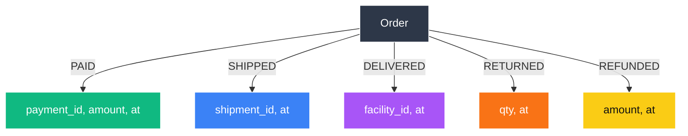

{:.lead}
SDD en SQL n’est pas plus simple au premier abord. Il déplace la complexité là où elle est légitime (journal de faits, relations et invariants) pour simplifier l’évolution et la maintenance à moyen terme.

> **Série SDD** : [Intro](/2025/11/01/sdd-intro/) • [Fondations](/2025/11/01/sdd/) • [Axiomes](/2025/11/08/sdd-core/) • [SQL E‑commerce](/2025/11/02/sdd-solves/)

PostgreSQL suffit pour modéliser ce « graphe conceptuel d’états » via des tables de faits immuables et des contraintes. Pas besoin d’introduire une base orientée graphe pour démarrer.

## Constats fréquents

| Ce qu’on veut | Ce qu’on fait | Ce qu’on obtient |
|---------------|---------------|------------------|
| Évolutivité | `ALTER TABLE ADD COLUMN is_promo` | Table monstre |
| Audit | `updated_at` | Perte de sens |
| Cohérence | `status ENUM` | Incohérence `status` vs `is_paid` |

## Le prix de la simplicité

- Passage de **1 table** à **6 tables de faits**.
- Mise en place de **3 triggers**.
- Contrepartie attendue :

| Avant (mono-table) | Après (SDD) |
|--------------------|-------------|
| 3 migrations bloquantes par sprint | 0 migration |
| 400 lignes de `CASE WHEN` dans le code | 0 |
| 2 bugs d’état par mois | 0 (invariants SQL) |

Coût initial en SQL, stabilité accrue à moyen terme.

## Cas de référence : commande e‑commerce

### 1. Mono‑table et ambiguïtés d’état

```sql
orders(
  id, customer_id, total,
  status ENUM('PENDING','PAID','PACKED','SHIPPED','DELIVERED','RETURNED','REFUNDED'),
  is_paid BOOLEAN, is_shipped BOOLEAN, is_returned BOOLEAN, is_refunded BOOLEAN,
  cancel_reason, cancelled_at,
  shipped_at, delivered_at,
  refund_amount, refunded_at,
  tracking_number, carrier,
  return_authorized_at, return_received_at
);
```

Ce schéma conduit fréquemment à l’ajout de booléens et de colonnes d’état redondantes, avec une auditabilité limitée.

### 2. Modèle SDD (relations événements d'état)

```sql
CREATE TABLE orders (
  id uuid PRIMARY KEY,
  customer_id uuid NOT NULL,
  total numeric(12,2) NOT NULL,
  created_at timestamptz NOT NULL DEFAULT now()
);

CREATE TABLE order_paid (
  order_id uuid NOT NULL REFERENCES orders(id),
  payment_id uuid NOT NULL,
  amount numeric(12,2) NOT NULL,
  paid_at timestamptz NOT NULL DEFAULT now(),
  PRIMARY KEY (order_id, paid_at)
);

CREATE TABLE order_shipped (
  order_id uuid NOT NULL REFERENCES orders(id),
  shipment_id uuid NOT NULL,
  shipped_at timestamptz NOT NULL DEFAULT now(),
  PRIMARY KEY (order_id, shipped_at)
);

CREATE TABLE order_delivered (
  order_id uuid NOT NULL REFERENCES orders(id),
  shipment_id uuid NOT NULL,
  facility_id uuid,
  delivered_at timestamptz NOT NULL DEFAULT now(),
  PRIMARY KEY (order_id, delivered_at)
);

CREATE TABLE order_returned (
  id uuid PRIMARY KEY,
  order_id uuid NOT NULL REFERENCES orders(id),
  qty int NOT NULL CHECK (qty > 0),
  returned_at timestamptz NOT NULL DEFAULT now()
);

CREATE TABLE order_refunded (
  order_id uuid NOT NULL REFERENCES orders(id),
  payment_id uuid NOT NULL,
  return_id uuid UNIQUE REFERENCES order_returned(id),
  amount numeric(12,2) NOT NULL,
  refunded_at timestamptz NOT NULL DEFAULT now(),
  PRIMARY KEY (order_id, refunded_at)
);
```

Les relations rendent explicites les événements (payé, expédié, livré). Chaque table représente un fait immuable. L’« état courant » est dérivable.

### 3. État courant (lecture)

```sql
WITH ev AS (
  SELECT order_id, 'PAID'::text AS type, paid_at AS at FROM order_paid
  UNION ALL SELECT order_id, 'SHIPPED', shipped_at FROM order_shipped
  UNION ALL SELECT order_id, 'DELIVERED', delivered_at FROM order_delivered
  UNION ALL SELECT order_id, 'RETURNED', returned_at FROM order_returned
  UNION ALL SELECT order_id, 'REFUNDED', refunded_at FROM order_refunded
)
SELECT order_id, (ARRAY_AGG(type ORDER BY at DESC))[1] AS current_status
FROM ev
WHERE order_id = :order_id
GROUP BY order_id;
```

On ne met plus à jour une colonne `status`. On dérive l’état depuis l’historique (append‑only).

### 4. Invariants SQL

```sql
CREATE OR REPLACE FUNCTION check_delivered_after_shipped()
RETURNS trigger AS $$
BEGIN
  IF EXISTS (
    SELECT 1
    FROM order_shipped s
    WHERE s.order_id = NEW.order_id
      AND s.shipped_at > NEW.delivered_at
  ) THEN
    RAISE EXCEPTION 'DELIVERED before SHIPPED for order %', NEW.order_id;
  END IF;
  RETURN NEW;
END; $$ LANGUAGE plpgsql;

CREATE TRIGGER trg_delivered_after_shipped
BEFORE INSERT ON order_delivered
FOR EACH ROW EXECUTE FUNCTION check_delivered_after_shipped();
```

Les invariants sont définis au niveau de la base (contraintes et triggers) pour verrouiller le graphe des transitions autorisées.

### 5. Visualisation des relations



Représentation d’un graphe conceptuel en SQL : des relations exprimant des événements d’état plutôt que des booléens.

## Option minimaliste : une table d’événements générique

```sql
CREATE TABLE order_event (
  order_id uuid NOT NULL,
  type text NOT NULL CHECK (type IN ('PAID','SHIPPED','DELIVERED','RETURNED','REFUNDED')),
  payload jsonb NOT NULL,
  at timestamptz NOT NULL DEFAULT now(),
  PRIMARY KEY (order_id, type, at)
);

-- Statut courant
SELECT type
FROM order_event
WHERE order_id = :id
ORDER BY at DESC
LIMIT 1;
```

Démarrage possible en version minimaliste : une seule table d’événements d’état, sans `ALTER TABLE`, avec historique complet. Les tables spécialisées peuvent être introduites ensuite pour renforcer les contraintes.

## Démarrage minimal (exemple)

1. Création de la table de faits.

   ```sql
   CREATE TABLE order_event (...);
   ```

2. Backfill depuis la mono‑table.

   ```sql
   INSERT INTO order_event (...)
   SELECT id, 'PAID', to_jsonb(...), paid_at
   FROM orders
   WHERE paid_at IS NOT NULL;
   ```

3. Matérialisation de la lecture.

   ```sql
   CREATE MATERIALIZED VIEW order_current AS
   SELECT order_id,
          (ARRAY_AGG(type ORDER BY at DESC))[1] AS current_status
   FROM order_event
   GROUP BY order_id;
   ```

4. Double‑écriture via trigger.

   ```sql
   CREATE TRIGGER trg_order_paid
     AFTER UPDATE OF status ON orders
     FOR EACH ROW
     WHEN (NEW.status = 'PAID' AND OLD.status IS DISTINCT FROM NEW.status)
     EXECUTE FUNCTION log_order_paid();
   ```

L’option minimaliste convient pour démarrer ; le modèle SDD détaillé apporte des garanties plus fortes (invariants et contraintes).

## Conclusion

> **SDD en SQL n’est pas plus simple.**
> **Il rend le modèle plus explicite.**
>
> On aligne la base, le code et l’équipe sur des invariants vérifiables.
