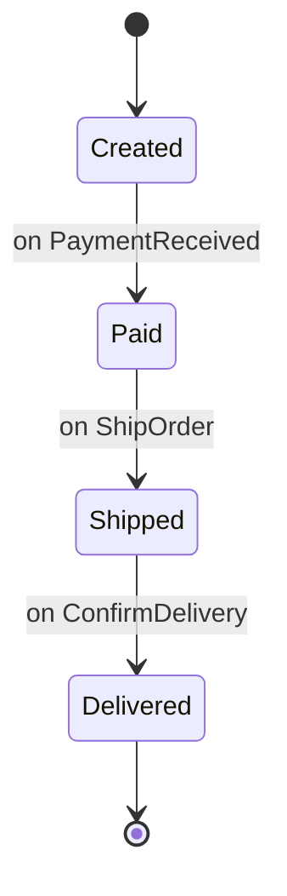

{:.lead}
> TL;DR.  
>Le réflexe *data-first* est et restera dominant, les tentatives de modélisation métier butent sur la gravité de la data.  
>L'agilité exerce une pression permanente sur la donnée, exacerbant les compromis et produisant une dette structurelle.  
>Alignons la donnée sur le **métier** en promouvant les **états** comme citoyens de première classe dans la data, pour plus de stabilité et d’évolutivité sans tomber dans le dogme et le déni de réalité du "domaine pur".
{:.prompt-tip}

## Le *data-first* est la gravité universelle des logiciels

Dans la plupart des projets, on arrive très rapidement à se poser la question de ce que l’on va stocker : les tables, leurs colonnes, leurs types.  

Certes, il existe des méthodes, des outils, des frameworks pour faire des ateliers, des diagrammes, des réunions avant ce moment fatidique où l’on va définir le schéma de données.  

Le projet a enfin démarré, on a un socle concret autour duquel on va pouvoir coder le métier.

### Le réflexe *data-first*

Le premier schéma est le reflet direct du besoin initial, et il aura vocation à évoluer au fil des itérations.

La logique métier se greffe ensuite autour d'objets, souvent anémiques, qui sont de simples structures de données qui reflètent les tables créées.

Les frameworks et ORM encouragent cette approche : créer un schéma et modifier les tables est simple, l’expression des **invariants** métier l’est beaucoup moins au début du projet.

Si on veut adopter les bonnes pratiques, on va créer des mappers pour isoler le domaine de la persistance, mais en première approche, on a tendance à coller au plus près du modèle relationnel car c'est sur celui-ci que s'est construite la modélisation initiale, la première compréhension du métier.

### La donnée est le point d'attraction principal

Lorsque le besoin évolue, la première question que se pose l'équipe est : « Ai-je besoin de rajouter une donnée supplémentaire ? Si oui, dans quelle table ? »  
Un `is_*` pour un cas particulier, une valeur à l'énumération `status` ou un `JSON` “pour anticiper les évolutions futures”.

Que ce soit pour enrichir le modèle ou pour corriger un comportement mal défini initialement, c'est toujours la donnée qui dicte la faisabilité des évolutions.  
Si elle est lacunaire ou pas assez expressive, on va devoir la modifier et in fine impacter la persistance.  

> Si le modèle métier ne peut pas être hydraté correctement à partir de la donnée existante, on ne peut pas réaliser la fonctionnalité attendue.
{:.prompt-warning}

Ce n'est donc pas tant le développeur qui trahit les bonnes pratiques, mais bien la gravité des données qui l'empêche de les appliquer.  

On savait déjà, grâce à [Dave McCrory](https://datagravitas.com), que la donnée était porteuse d'une force gravitationnelle de couplage avec elle-même, mais celle-ci s'exerce aussi sur le modèle métier que l'on estimait comme indépendant de la persistance.

L'inversion de dépendance ne fait que déplacer le problème : on reste prisonnier du couplage avec l'effet de bord que représente la persistance.

Prenons une table orders avec status ENUM(...), `is_cancelled`, `cancel_reason`, `refunded_at`, `modified_at`.
Selon les combinaisons, tout est “possible” : payé mais sans date, remboursé sans montant, annulé mais livré.
La table s'enrichie et la complexité explose.

>Assumons-le : le *data-first* est la gravité universelle des logiciels et ne sera jamais vaincu.  
Sortons de l'illusion que nous pouvons construire des systèmes découplés de la data, adoptons une approche pragmatique et réaliste pour limiter les dégâts.
{:.prompt-info}

## L'Agilité comme catalyseur de dette

Dans le contexte d'équipes agiles, on procède par itérations rapides, c'est la norme.

Chaque sprint apporte son lot de changements, souvent urgents, et la pression pour livrer pousse à des solutions rapides.

Comme nous l'avons vu précédemment, le modèle de données sous-jacent est souvent impacté par ces changements.
Censé être stable, il peut vite devenir un champ de bataille, où l'on ajoute des colonnes, on ajoute des énumérations, certains champs deviennent zombies.

### Accumulation de compromis

Au fur et à mesure, les tables deviennent donc des **strates de compromis** : champs “optionnels selon le cas”, flags décisionnels, enums plats, `modified_at` pour tous. Dans les systèmes matures, des tables comme `Product`, `Customer` ou `Order` grossissent jusqu’à diluer le métier dans un maelström de colonnes.

> On doit alors se fier à l'expérience et à la mémoire collective, plutôt qu'à une structure claire et cohérente.  
Ne comptons pas sur la documentation pour compenser un modèle confus : elle est toujours obsolète, incomplète ou les deux.
{:.prompt-warning }

### Impacts sur le code métier

Conséquences visibles dans le code : entités massives, `if/else` proliférants, règles implicites, couplage diffus.  

La maintenance vire à l’archéologie ; un état ajouté appelle des retouches en cascade. Sous pression, on multiplie migrations, tests, refactorings ORM : la dette structurelle s’installe, paradoxale en contexte agile.

Même si ce code est contractuellement défini par un repository, la nécessité de garantir une cohérence ne disparaît pas par enchantement, elle se déplace.

Des **idées reçues** aggravent encore la situation : on promet qu’une séparation domaine–persistance permettra “de changer de base sans douleur”. En pratique, ce sont les **ambiguïtés sémantiques** (flags, nullables, enums surchargés) qui coûtent bien plus cher au projet.

> L'agilité met en tension le modèle de données, exacerbant les compromis et produisant une dette structurelle sur la donnée.
{:.prompt-warning }

## Une approche qualitative des données de l'entité métier

 Le constat précédent peut apparaître exagérément alarmiste, dans bien des cas rajouter une colonne ou un flag dans une table ne fait pas s'effondrer l'application.
 En effet rajouter une adresse email secondaire dans une table utilisateur n'aura aucun impact majeur sur le code métier.  

### Toutes les données ne se valent pas

 Mais rajouter un flag `is_cancelled` dans une table de commande, ou rajouter un état `shipped` dans une énumération `status` d'une table de gestion des stocks, peut avoir des conséquences majeures sur le code métier.

 C'est ici que doit se porter notre attention : toutes les données ne se valent pas, certaines sont porteuses de règles métier fortes, d'autres sont plus neutres, voire accessoires.

 Quand on va rajouter ou modifier un attribut qui porte l'état au sens fonctionnel du métier, on impacte potentiellement la cohérence de l'entité métier, et donc potentiellement tout le code existant qui s'en assure.

 C'est donc l'état, sa cardinalité, son exhaustivité, ses transitions, et ses invariants qui doivent être au centre de nos préoccupations quand on modélise la persistance. Ce n'est un champ optionnel, un flag, ou une énumération plate qui va nous permettre d'exprimer correctement ces notions.

 On ne traite pas un `is_cancelled` comme un simple champ décoratif. Il décide du récit métier.

 > L'état est de facto un citoyen de première classe dans nos système, et doit être traité comme tel dans la couche de persistance.
{:.prompt-info }

### Le State-Driven Design : une modélisation centrée sur les états

Le **State-Driven Design (SDD)** recentre la modélisation sur l'isolement des **états** dans nos structures de données.  

L'état quitte l’entité “fourre-tout” pour se caractériser lui-même comme une donnée riche et porteuse de caractéristiques métier fortes.  

Un état porte ses propres **invariants** et des propriétés qui lui sont propres. Un simple booléen ou un `status` plat ne suffisent pas à capturer cette richesse, d'où les colonnes “optionnelles selon le cas” qui prolifèrent dans les tables fourre-tout.

### La data porteuse du métier

Une entité vivante a donc plusieurs états possibles, chacun avec ses propres règles, et un seul état est actif à un instant donné.  
Le cycle de vie de l'entité est donc une succession de transitions entre ces états, chacune avec ses propres conditions d'entrée et de sortie.

### Principes clés du SDD

> Le SDD propose une approche pragmatique pour aligner la donnée sur le métier en promouvant les états comme citoyens de première classe.
{:.prompt-info }

- **États par facettes.** Les domaines réels combinent des axes orthogonaux (paiement, livraison, conformité…). On parle d’**états exclusifs & exhaustifs par facette**, plutôt que d’un état global explosif.
- **Température des données.**  
  *Froid* : ce qui ne casse rien si ça change (nom, email secondaire).  
  *Chaud* :  ce qui porte un sens métier fort (état, transition, raison, auteur).  
  Les confondre produit de l'ambiguïté et de la dette.
- **L’état est un langage.** Un état porte des **invariants** ; un booléen ou un `status` plat n’en porte pas, d’où les colonnes “optionnelles selon le cas”.
- **L’histoire est une succession d’états.** Le cycle de vie d’une entité est une succession de transitions entre états, chacun avec ses propres conditions d’entrée et de sortie.
- **Citoyen du langage métier.** L’état intrinsèquement lié au métier, il porte la sémantique et le language ubiquitaire du domaine.

Tant qu’on traite l’état comme un détail technique (booléens, enums plats, flags optionnels), on fabrique de la dette en continu.
Le SDD ne demande pas plus de cérémonial, il demande plus d’honnêteté sur l'importance du design de la persistance de l'état dans nos logiciels.  

[Comment modéliser les états avec le SDD ? →](/2025/11/08/sdd-core/)
