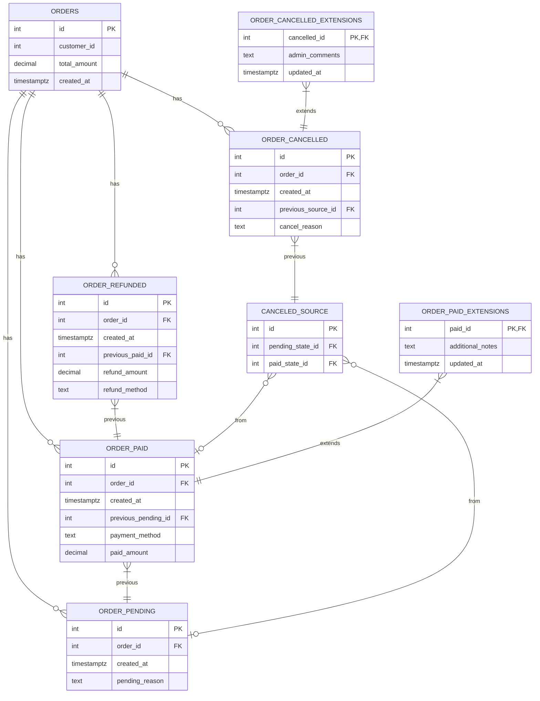

{:.lead}

Cet article montre comment modéliser un workflow métier en SQL sans table fourre‑tout pleine de statuts et de booléens. On construit un graphe d’états explicite (PENDING, PAID, CANCELLED, REFUNDED) où chaque état est une table de faits immuable, et on dérive l’état courant via des vues.

> **TL;DR**  
> Au lieu d’une table `orders` avec une colonne `status` et quelques booléens (`is_paid`, `is_cancelled`, …), on sépare l’entité (`orders`) de ses états (`order_pending`, `order_paid`, `order_cancelled`, `order_refunded`). Chaque état est append‑only, les transitions sont encodées par des clés étrangères, et l’état courant est dérivé via des vues SQL.
{:.prompt-tip}

La plupart des modèles SQL que l’on rencontre en production finissent par se ressembler : une table centrale `orders`, quelques colonnes métier, un `status` ENUM qui grossit à chaque nouvelle feature, et une poignée de booléens rajoutés au fil des sprints.  
Tant que le domaine reste simple, ce bricolage tient à peu près. Mais dès que le système vit quelques années, le modèle devient opaque : combinaisons impossibles, colonnes optionnelles dont on ne sait plus à quel état elles se rapportent, règles métier cachées dans des `CASE WHEN` disséminés dans le code.

Le State‑Driven Design (SDD) propose un autre chemin : au lieu de coller tout le métier dans une seule table, on commence par expliciter **les états** et **les transitions** du domaine. En SQL, ça se traduit par une séparation nette entre :

- une table d’entité, neutre, qui porte l’identité et les attributs stables (`orders`) ;
- des tables d’états append‑only (`order_pending`, `order_paid`, `order_cancelled`, `order_refunded`) ;
- des relations qui encodent les transitions autorisées (y compris les cas « OU », comme « cancel depuis PENDING ou depuis PAID »).

Dans les billets précédents de la série SDD, on a posé le constat, les axiomes, puis esquissé ce que pourrait donner un modèle SQL orienté états. Ici, on rentre dans le concret : on détaille un schéma complet pour une commande e‑commerce, on montre comment chaque table correspond à un état métier, comment les transitions sont encodées, et comment dériver l’état courant sans une seule colonne `status`. En complément du [manifeste](/2025/11/09/sdd-manifesto/) et des [principes de modélisation](/2025/11/08/sdd-core/), ce billet se concentre sur la traduction de ces idées dans un schéma SQL concret.  
L’objectif est qu’à la fin de l’article, tu puisses transposer ce pattern dans ton propre domaine, sans changer de base de données ni introduire d’outils exotiques : du SQL pur, mais réfléchi « par états » plutôt que « par lignes de status ».

## Principes de modélisation SDD en SQL

1. **Séparer entité et états** : `orders` contient les attributs stables (identité, client, montant, dates), les états métier vivent dans des tables dédiées.
2. **Un état = une table de faits immuable** : on n’update pas un état, on ajoute un nouveau fait daté.
3. **Les transitions sont des références** : chaque ligne d’un état pointe vers l’état précédent (ou une table de mapping pour les cas « OU » comme `cancelled_source`).
4. **Les enrichissements optionnels sont externalisés** : les données mutables, non décisionnelles, partent dans des tables d’extensions.
5. **L’état courant est dérivé** : des vues (ou CTE) construisent l’état actif à partir de l’historique, plutôt que de stocker un `status`.

## Schéma SQL complet

```sql
-- Table principale pour l'entité commande (attributs neutres, non porteurs d'état)
CREATE TABLE orders (
    id SERIAL PRIMARY KEY,
    customer_id INTEGER NOT NULL,  -- Référence à un client (externe au modèle)
    total_amount DECIMAL(10, 2) NOT NULL,  -- Montant total initial (immuable)
    created_at TIMESTAMPTZ NOT NULL DEFAULT NOW()  -- Date de création de la commande
);

-- Table pour l'état initial : Pending (en attente)
-- Précédent : Aucun (état initial)
CREATE TABLE order_pending (
    id SERIAL PRIMARY KEY,
    order_id INTEGER NOT NULL REFERENCES orders(id),
    created_at TIMESTAMPTZ NOT NULL DEFAULT NOW(),  -- Timestamp unique
    -- Attributs spécifiques à Pending (tous non nuls, immuables)
    pending_reason TEXT NOT NULL  -- Raison de l'attente (ex. : validation en cours)
);

-- Table pour l'état Paid (payée)
-- Précédent : Uniquement Pending (référence directe)
CREATE TABLE order_paid (
    id SERIAL PRIMARY KEY,
    order_id INTEGER NOT NULL REFERENCES orders(id),
    created_at TIMESTAMPTZ NOT NULL DEFAULT NOW(),  -- Timestamp unique
    previous_pending_id INTEGER NOT NULL REFERENCES order_pending(id),  -- Référence à l'état précédent
    -- Attributs spécifiques à Paid (tous non nuls, immuables)
    payment_method TEXT NOT NULL,  -- Méthode de paiement
    paid_amount DECIMAL(10, 2) NOT NULL  -- Montant payé
);

-- Table pour l'état Cancelled (annulée)
-- Précédents possibles : Pending OU Paid (via table cancelled_source pour le "OR")
CREATE TABLE order_cancelled (
    id SERIAL PRIMARY KEY,
    order_id INTEGER NOT NULL REFERENCES orders(id),
    created_at TIMESTAMPTZ NOT NULL DEFAULT NOW(),  -- Timestamp unique
    previous_source_id INTEGER NOT NULL REFERENCES cancelled_source(id),  -- Référence à la source précédente
    -- Attributs spécifiques à Cancelled (tous non nuls, immuables)
    cancel_reason TEXT NOT NULL  -- Raison de l'annulation
);

-- Table de mapping pour transitions vers Cancelled (représente le "OR" des précédents)
-- Restreint les transitions autorisées via structure déclarative
CREATE TABLE cancelled_source (
    id SERIAL PRIMARY KEY,
    pending_state_id INTEGER REFERENCES order_pending(id),  -- Référence à Pending (nullable si non applicable)
    paid_state_id INTEGER REFERENCES order_paid(id),  -- Référence à Paid (nullable si non applicable)
    CHECK (
        (pending_state_id IS NOT NULL AND paid_state_id IS NULL) OR
        (pending_state_id IS NULL AND paid_state_id IS NOT NULL)
    )  -- Vérifie qu'exactement une des deux références est non nulle
    -- Note : Cette contrainte CHECK assure l'intégrité structurelle de la table de mapping, en complément de la logique applicative.
);

-- Table pour l'état Refunded (remboursée)
-- Précédent : Uniquement Paid (référence directe)
CREATE TABLE order_refunded (
    id SERIAL PRIMARY KEY,
    order_id INTEGER NOT NULL REFERENCES orders(id),
    created_at TIMESTAMPTZ NOT NULL DEFAULT NOW(),  -- Timestamp unique
    previous_paid_id INTEGER NOT NULL REFERENCES order_paid(id),  -- Référence à l'état précédent
    -- Attributs spécifiques à Refunded (tous non nuls, immuables)
    refund_amount DECIMAL(10, 2) NOT NULL,  -- Montant remboursé
    refund_method TEXT NOT NULL  -- Méthode de remboursement
);

-- Tables d'extension pour enrichissements non décisionnels (optionnels, mutables)
-- Exemple pour état Paid : notes supplémentaires (ne modifient pas l'état)
CREATE TABLE order_paid_extensions (
    paid_id INTEGER PRIMARY KEY REFERENCES order_paid(id),
    additional_notes TEXT,  -- Optionnel, mutable
    updated_at TIMESTAMPTZ NOT NULL DEFAULT NOW()  -- Traçabilité des mises à jour
);

-- Exemple pour état Cancelled : détails administratifs (ne modifient pas l'état)
CREATE TABLE order_cancelled_extensions (
    cancelled_id INTEGER PRIMARY KEY REFERENCES order_cancelled(id),
    admin_comments TEXT,  -- Optionnel, mutable
    updated_at TIMESTAMPTZ NOT NULL DEFAULT NOW()  -- Traçabilité des mises à jour
);

-- Vue pour dériver les intervalles temporels (début/fin d'états)
-- Permet de calculer la fin d'un état comme le début du suivant
CREATE VIEW order_state_intervals AS
SELECT 
    o.id AS order_id,
    'PENDING' AS state_type,
    op.created_at AS start_at,
    COALESCE(
        (SELECT MIN(created_at) FROM order_paid WHERE previous_pending_id = op.id),
        (SELECT MIN(oc.created_at) FROM order_cancelled oc
         JOIN cancelled_source cs ON cs.id = oc.previous_source_id
         WHERE cs.pending_state_id = op.id),
        NULL  -- Ouvert si pas de suivant
    ) AS end_at
FROM orders o
JOIN order_pending op ON op.order_id = o.id

UNION ALL

SELECT 
    o.id AS order_id,
    'PAID' AS state_type,
    opa.created_at AS start_at,
    COALESCE(
        (SELECT MIN(created_at) FROM order_refunded WHERE previous_paid_id = opa.id),
        (SELECT MIN(oc.created_at) FROM order_cancelled oc
         JOIN cancelled_source cs ON cs.id = oc.previous_source_id
         WHERE cs.paid_state_id = opa.id),
        NULL  -- Ouvert si pas de suivant
    ) AS end_at
FROM orders o
JOIN order_paid opa ON opa.order_id = o.id

UNION ALL

SELECT 
    o.id AS order_id,
    'CANCELLED' AS state_type,
    oc.created_at AS start_at,
    NULL AS end_at  -- État final, scellé (pas de transitions sortantes)
FROM orders o
JOIN order_cancelled oc ON oc.order_id = o.id

UNION ALL

SELECT 
    o.id AS order_id,
    'REFUNDED' AS state_type,
    orf.created_at AS start_at,
    NULL AS end_at  -- État final, scellé (pas de transitions sortantes)
FROM orders o
JOIN order_refunded orf ON orf.order_id = o.id;

-- Vue pour l'état actif courant par commande
-- Basée sur l'absence de suivant (end_at IS NULL)
CREATE VIEW current_order_states AS
SELECT 
    order_id,
    state_type,
    start_at
FROM order_state_intervals
WHERE end_at IS NULL;
```

## Diagramme ER



## Lire et exploiter ce modèle

Quelques points pour l’usage concret :

- **Écriture** : on n’update jamais un `status` dans `orders`, on insère des faits dans les tables d’états (`order_pending`, `order_paid`, …).
- **Lecture de l’état courant** : on interroge la vue `current_order_states` (ou une CTE équivalente) pour connaître l’état actif d’une commande.
- **Analyse métier** : la vue `order_state_intervals` permet de calculer des durées (temps moyen en `PENDING`, temps avant `CANCELLED` après `PAID`, etc.).

## Conclusion

En partant d’une commande e‑commerce, on a construit un modèle SQL qui reflète vraiment la dynamique métier :

- `orders` concentre les attributs stables de l’entité ;
- chaque état métier (`PENDING`, `PAID`, `CANCELLED`, `REFUNDED`) est une table de faits immuable ;
- les transitions sont encodées par des références explicites (`previous_pending_id`, `previous_paid_id`, `canceled_source`, …) ;
- l’état courant et les durées par état sont dérivés via des vues (`order_state_intervals`, `current_order_states`), pas stockés dans une colonne `status`.

Ce choix a un coût initial : plus de tables, quelques vues, parfois des contraintes un peu verbeuses. Mais il simplifie trois choses essentielles à moyen terme :

- **Évolution** : ajouter un nouvel état ou une nouvelle transition devient une extension du graphe (une table, une relation), pas un `ALTER TABLE` risqué sur une table centrale.
- **Cohérence** : les invariants se déplacent du code applicatif vers le schéma (FK, `CHECK`, triggers si nécessaire) ; certaines combinaisons d’états deviennent tout simplement impossibles à représenter.
- **Lecture métier** : l’historique des états est immédiat à explorer en SQL, et les indicateurs (temps passé en PENDING, taux d’annulation après PAID, etc.) tombent naturellement.

Tu n’es pas obligé d’adopter l’intégralité du pattern pour en tirer un bénéfice. Tu peux commencer petit : extraire un premier état volatile dans sa propre table, remplacer quelques booléens par des tables d’événements append‑only, introduire une vue qui dérive l’état courant plutôt qu’une colonne mutée.  
À mesure que ton domaine et ta base grandissent, tu pourras faire évoluer ton schéma dans le sens d’un graphe d’états de plus en plus explicite.

Le message central reste le même que dans le reste de la série SDD : la donnée n’est pas qu’un stockage, c’est la projection d’un langage métier. En SQL aussi, on peut choisir de raconter l’histoire par des états et des transitions plutôt que par un status fourre‑tout. À toi d’expérimenter ce modèle sur un morceau de ton système, de mesurer le gain, et de décider jusqu’où tu veux pousser le curseur.
