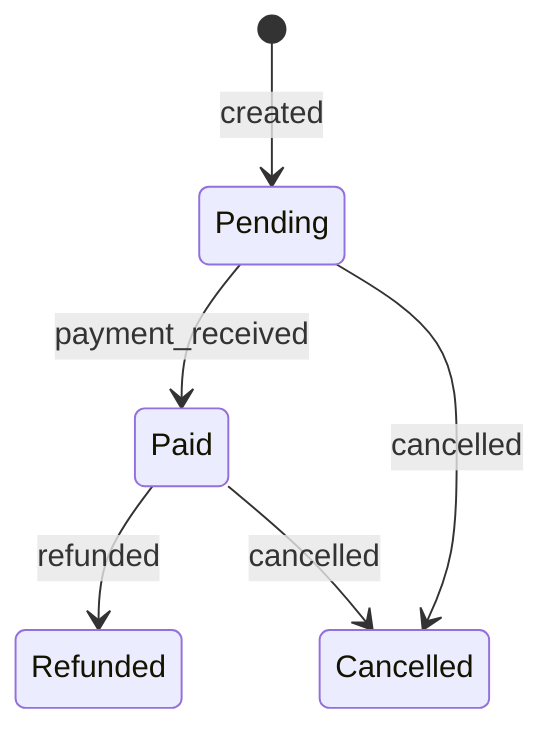
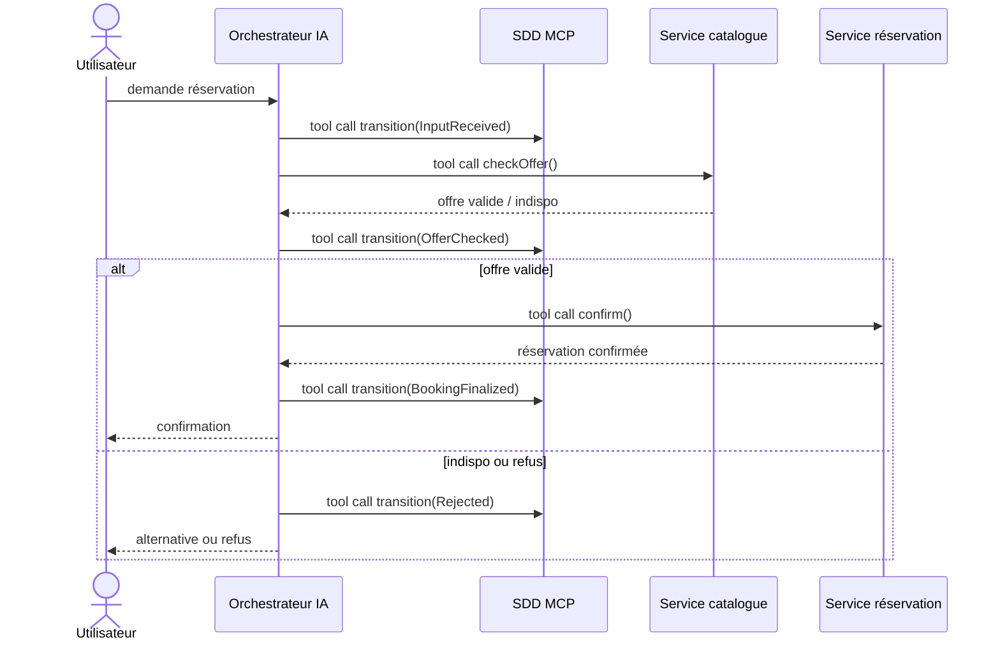

{:.lead}
Le State-Driven Design (SDD) ne se limite pas à des schémas élégants. Il sert avant tout à remettre de l'ordre dans des systèmes vivants, à clarifier les états réellement existants, et à rendre les transitions observables et auditables. Cet article prolonge la série SDD avec deux cas concrets : un legacy auquel on ajoute une « ceinture de sécurité » via des événements métiers, puis un workflow d'IA sécurisé par des états explicites.

> **TL;DR**
> Le SDD n'est pas un luxe de greenfield. Il peut renforcer un legacy sans tout réécrire, et structurer un workflow d'IA pour y mettre des contrôles, de l'audit et des points d'arrêt nets.
{:.prompt-tip}

Si vous souhaitez les bases, commencez par le [manifeste](/2025/11/09/sdd-manifesto/) et la [modélisation des états](/2025/11/08/sdd-core/). Pour un exemple SQL complet, voir [SDD en SQL](/2025/11/12/sdd-sql-states/).

## Rappel express des principes utiles

Sans tout reprendre, ces points sont indispensables pour la suite :

1. **États explicites** : un état est une variante exclusive et exhaustive du domaine.
2. **Transitions explicites** : un changement d'état est un fait, pas une mise à jour silencieuse.
3. **Historisation** : on conserve tout l'historique, on ne modifie pas le passé.
4. **Invariants localisés** : chaque état a ses contraintes propres.
5. **État dérivable** : l'état courant se calcule, il n'est pas "magique".

Ces principes permettent de poser des structures solides, même autour d'un legacy ou d'un workflow moderne mais instable.

### Mini glossaire (2 minutes)

- **ADT (Algebraic Data Type)** : ici, un *type somme* (ex. `Pending | Paid | Cancelled | Refunded`) qui force une modélisation **exclusive** des états.
- **Outbox** : table/queue locale où l'application écrit des événements métiers de façon atomique avec ses changements, puis un worker les publie vers le bus.
- **CDC (Change Data Capture)** : mécanisme (log DB / réplication / outil dédié) qui capte les changements de données pour en dériver un flux d'événements.
- **MCP** : dans cet article, un service exposé comme “outils” pour l’orchestrateur IA, utilisé pour enregistrer/valider des transitions SDD.

## Exemple 1 - Ceinture de sécurité pour un legacy

### Contexte

Un legacy est rarement bien modélisé. On y trouve des champs de statut, des booléens décisionnels, et une logique métier diffuse. On ne peut pas tout refactorer, mais on peut **sécuriser l'existant** en rendant les transitions observables et auditables.

L'idée n'est pas de réécrire l'application, mais de **publier des événements métiers alignés sur les états**. Cela devient une « ceinture de sécurité » : on commence à voir ce qui se passe vraiment, on peut brancher des contrôles. Le refactoring de fond devient alors plus serein.

### Approche

1. **Cartographier un ADT minimal** : lister les états effectifs (même imparfaits) du domaine.
2. **Nommer les transitions** : chaque passage d'état doit correspondre à un événement métier clair.
3. **Publier les événements** : via une outbox, du CDC ou un job batch qui détecte les changements.
4. **Consommer pour audit** : monitoring, alertes, réconciliation, et premier filet de sécurité.

Concrètement, pour “publier sans tout réécrire”, vise un chemin le plus court possible :

- **Choisir le point de capture** : idéalement là où le statut change (service, transaction). À défaut, un batch/CDC fait l’affaire au début.
- **Standardiser une enveloppe d’événement** : `event_id` (UUID), `occurred_at`, `entity_id`, `from_state`, `to_state`, `reason`, `correlation_id` (trace bout-en-bout), `schema_version`.
- **Rendre l’émission idempotente** : un événement = une clé unique (`event_id` ou contrainte sur `(entity_id, to_state, occurred_at_bucket)` selon ton contexte).
- **Penser “clé de partition”** : généralement `entity_id` pour garder l’ordre des transitions par entité.
- **Démarrer par l’audit** : même sans consommateurs métier, tu gagnes déjà en visibilité (écarts, transitions “impossibles”, stats de flux).

### Schéma de principe (Mermaid)

### Ce que le SDD apporte ici

- **Traçabilité** : chaque transition devient un événement observable.
- **Réduction des ambiguïtés sémantiques** : un état clair vaut mieux que trois flags.
- **Audit réel** : on peut rejouer l'historique et comparer ce qui a été fait vs attendu.
- **Préparation à la migration** : on a déjà la cartographie d'états et un flux d'événements.

## Exemple 2 - Sécuriser un workflow d'IA

### Contexte

Prenons un cas général : une plateforme de réservation (hôtel, billet, location). L'IA orchestre la demande utilisateur, appelle des services métiers, puis propose ou confirme la réservation. Le risque vient des appels externes (prix, disponibilité, règles), des décisions implicites, et des erreurs silencieuses.

Ici, le SDD est exposé via un **service MCP** dédié. Il joue le rôle de source de vérité des états. L'orchestrateur n'avance jamais « en douceur » : il enregistre chaque transition d'état via un appel d'outil vers ce service. Le SDD valide la transition, refuse les écarts, et conserve l'historique.

### Approche (avec tool calling)

1. **InputReceived** : demande utilisateur reçue et normalisée, transition enregistrée via le MCP SDD.
2. **OfferChecked** : appel d'outil pour vérifier disponibilité + prix, puis transition enregistrée via le MCP SDD.
3. **BookingFinalized** (ou **Rejected**) : confirmation finale ou refus explicite, transition enregistrée via le MCP SDD.

Chaque transition est un fait métier : elle peut être auditée, rejouée, et contrôlée.

Deux détails qui font la différence en pratique :

- **Pas de “tool call anonyme”** : chaque transition devrait porter un `correlation_id` (et idéalement un `decision_id`) pour relier le raisonnement, les appels externes et l’état final.
- **Refus explicite > erreur implicite** : si une étape échoue (timeout, incohérence, refus business), on transitionne vers `Rejected` (avec un `reason`), plutôt que de rester “entre deux”.

### Schéma de principe (Mermaid)

### Ce que le SDD apporte ici

- **Contrôle** : le MCP SDD refuse les transitions invalides et impose l'ordre des états.
- **Explicabilité** : l'historique SDD montre quel appel a bloqué la réservation.
- **Reprise** : on repart d'un état connu sans bricoler le pipeline.
- **Auditabilité** : transitions + décisions = journal complet et vérifiable.

Quelques contrôles typiques (très concrets) :

- **Garde de transitions** : `OfferChecked` n’est autorisé que si l’état courant est `InputReceived`, sinon rejet.
- **Invariants par état** : ex. `BookingFinalized` exige un `booking_id` et un `price_snapshot` signés/horodatés.
- **Sécurité** : seules certaines identités/outils peuvent effectuer des transitions sensibles (ex. finalisation), avec une trace d’audit systématique.
- **Points d’arrêt** : possibilité d’introduire un état `RequiresReview` (humain ou règle) sans “casser” le workflow.

## Conseils pratiques pour démarrer

- **Commencer petit** : une facette métier, un seul flux d'événements, un ADT minimal.
- **Sceller les états finaux** : pas de transitions sortantes implicites.
- **Mesurer vite** : combien de transitions "impossibles" apparaissent une fois exposées ?

## Conclusion

Le SDD n'est pas seulement une méthode de modélisation : c'est un cadre pour rendre les systèmes observables, cohérents et évolutifs. Dans un legacy, il sert de ceinture de sécurité. Dans un workflow d'IA, il fait office de garde-fou structurel.

Si vous voulez un plan d’attaque simple pour démarrer dès demain :

1. **Lister 4–7 états réels** d’un flux (même “sales”) et nommer 5–10 transitions.
2. **Définir l’enveloppe d’événements** (idempotence + corrélation) et publier *uniquement* pour l’audit au début.
3. **Ajouter une garde** qui refuse 1 transition “impossible” (preuve immédiate de valeur).
4. **Brancher un tableau de bord** (volume, erreurs, transitions rejetées) et itérer.

Si vous souhaitez un support concret pour modéliser ces états et leurs transitions, j'ai publié un outil open source ici : https://github.com/ng-galien/sdd-modeler.

## Articles en relation

- [La vraie histoire d'un logiciel](/2025/11/09/sdd-manifesto/)
- [Modéliser les états](/2025/11/08/sdd-core/)
- [SDD en SQL : modéliser les états plutôt que des statuts](/2025/11/12/sdd-sql-states/)
