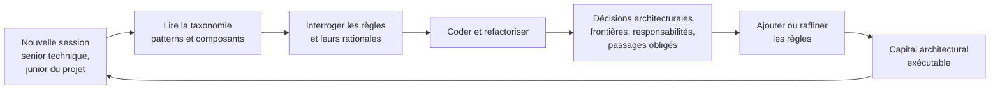

Code Moniker est un projet qui existe depuis déjà quelque temps. C’est un gros
projet en Rust, avec beaucoup de composants et une histoire assez longue. Je
l’utilise moi-même dans d’autres projets.

Son idée initiale est le résultat de plusieurs tentatives. Au départ, je
cherchais à donner aux agents une forme de mémoire sous la forme d’un graphe
libre. Cela n’a pas donné grand-chose de vraiment convaincant. Je suis donc
revenu vers ce que je connais et vers le domaine dans lequel je peux réellement
exercer mon métier : le code.

Code Moniker est devenu un système d’indexation qui construit un graphe de
connaissances à partir des symboles du code et de leurs relations. Un agent peut
interroger ce graphe, le parcourir et chercher à comprendre comment les éléments
d’un système sont reliés. Code Moniker n’est évidemment pas le seul projet à
faire cela. Ce n’est sûrement pas non plus le meilleur. Mais il a maintenant une
existence réelle, une certaine profondeur et plusieurs usages.

Pourtant, je n’ai jamais obtenu de résultat suffisamment spectaculaire pour dire
que le graphe changeait à lui seul la manière dont un agent comprend un projet.
Je n’arrive même pas réellement à quantifier son intérêt par rapport à un agent
qui explore les fichiers avec `grep`. Mon intuition initiale était qu’en
parcourant les symboles et leurs relations, l’agent finirait par comprendre le
projet presque tout seul. Cette intuition n’est pas complètement invalidée, mais
je pense aujourd’hui que cela fonctionne moins bien que je ne l’imaginais, et
que la recherche textuelle reste souvent très efficace.

J’ai d’ailleurs essayé de le mesurer, sur un banc d’essai monté autour d’un cas
SWE-PolyBench : un bug d’Apache Dubbo où la commande telnet `invoke` ne pouvait
atteindre qu’un seul des deux providers exposant la même interface sous deux
groupes. La correction canonique, celle que les mainteneurs ont fini par
retenir, demandait de monter en abstraction : quitter le handler telnet où
vivait le symptôme et pivoter vers le modèle applicatif, à travers plusieurs
packages. Livré à lui-même, l’agent n’a pas fait ce saut. Il est resté concentré
sur la résolution locale du bug, et le graphe ne l’y a pas aidé davantage que
`grep`. Le seul agent qui montait au niveau supérieur était celui dont le prompt
imposait une posture d’architecte, et il y parvenait aussi bien avec `grep` et
`git log` qu’avec l’index symbolique. À prompt égal, l’écart entre les deux
restait dans le bruit. L’essentiel venait du prompt, pas du substrat.

## Le DSL de règles

Une autre capacité est apparue assez tôt dans Code Moniker, et celle-ci m’est
utile de manière beaucoup plus concrète : les règles.

Code Moniker possède un DSL qui permet d’écrire des règles d’architecture, des
règles de qualité du code et des détections de smells. Il ne sait pas exprimer
toutes les règles possibles et ne remplace pas un outil comme Sonar. Mais il
sait tout de même en vérifier un certain nombre, et il les exécute rapidement.
Je l’utilisais déjà, probablement pas encore assez, sans avoir complètement
formulé ce que ces règles pouvaient représenter.

Cette formulation m’est venue à l’occasion d’un gros travail de refactoring.

## Après le vibe coding

L’année dernière, j’ai avancé très rapidement sur certains projets en faisant du
vibe coding. Le résultat fonctionnel était à peu près là. Dans le cas qui a
déclenché cette réflexion, il s’agissait d’une extension et ses parcours
principaux étaient couverts par des tests d’acceptation.

Mais cette vitesse avait produit ce qu’elle produit souvent lorsqu’on code en
mode YOLO : un plat de spaghettis monstrueux, du code dupliqué un peu partout,
des concepts flous et des responsabilités mal réparties. Il faut l’assumer. Le
résultat avait été obtenu, mais il restait plusieurs jours de refactoring pour
en faire un système que l’on puisse réellement continuer à faire évoluer.

Ce refactoring est un véritable travail de pair programming avec l’agent. Il
faut découvrir où se trouvent les bons modules, décider de leurs
responsabilités, redécouper le système, nettoyer les duplications et clarifier
le langage ubiquitaire du projet. L’agent ne fait pas nécessairement très bien
ce travail tout seul. Il peut produire un découpage artificiel ou ne pas
réellement savoir où placer les frontières. Le dialogue est donc essentiel pour
faire émerger les responsabilités et les bons concepts.

Une fois une zone correctement refactorée, une question se pose : comment éviter
qu’elle revienne progressivement à son état précédent ?

C’est précisément là que Code Moniker peut changer de rôle. Puisque je dispose
déjà d’un outil d’architecture capable d’analyser TypeScript et plusieurs autres
langages, et d’un DSL de règles, chaque décision obtenue pendant le refactoring
peut être suivie d’une règle.

Mais toutes les règles ne se valent pas, et il m’a fallu ce refactoring pour le
formuler. Une bonne partie de ce que ces outils savent détecter relève des
smells classiques : une fonction trop longue, trop de paramètres, un peu de
duplication locale. Ce sont des heuristiques héritées de règles humaines, et
elles restent secondaires. Un code qui les viole est un code un peu sale, mais
il fonctionne, et il continuera de fonctionner.

Violer des frontières et des responsabilités, en revanche, c’est mortel. Une
logique de gestion d’erreurs éparpillée partout, un comportement dispatché à des
dizaines d’endroits, des variantes dupliquées qu’il faut réaligner à chaque
évolution : ce n’est plus du code sale, c’est un système qui ne marche plus. La
règle qui compte est donc celle qui verrouille un passage obligé. Si l’on veut
modifier tel comportement, on passe par là, toujours par là, et nulle part
ailleurs. C’est cette règle-là que le refactoring doit laisser derrière lui.

Avec les agents, cette hiérarchie devient encore plus importante. Un agent qui
laisse passer une fonction un peu longue ne casse rien. Mais chaque nouvelle
session est capable de réinventer un chemin à côté du passage obligé si rien ne
le verrouille.

## Le capital de seniorité

Je me suis demandé si ces règles ne représentaient pas, très concrètement,
l’acquisition de la seniorité du projet.

On part d’un projet rempli de spaghettis. On le refactorise, on découvre ses
véritables modules, on redéfinit ses frontières, ses responsabilités et son
langage ubiquitaire. Les règles écrivent ensuite ce qui a été compris et décidé
à ce moment-là. Elles conservent cette compréhension au-delà de la session de
travail pendant laquelle elle est apparue.

C’est une forme de sédimentation, au bon sens du terme. Le projet mûrit parce
qu’il se connaît mieux. Il ne se contente plus de posséder du code qui
fonctionne : on sait davantage qui fait quoi, pourquoi et comment.

Les études sur les projets informatiques, et plus généralement l’expérience de
n’importe quelle équipe, montrent ce qui arrive lorsque des personnes clés
partent ou que le turnover devient important. Le projet perd de l’expérience et
de la seniorité. Cette connaissance ne se reconstitue pas instantanément.

Quelles que soient ses compétences techniques, une personne qui arrive sur un
gros projet traverse une phase d’onboarding, d’apprentissage et d’immersion.
Elle doit comprendre son histoire, ses concepts et les raisons pour lesquelles
les choses sont organisées comme elles le sont. Être senior techniquement ne
rend pas immédiatement senior dans un projet que l’on ne connaît pas.

Cette distinction aide à formuler un problème fondamental des agents. Chaque
nouvelle session fait arriver un junior sur le projet.

L’analogie serait celle d’un projet traditionnel de cinquante développeurs sur
lequel les prestataires changeraient tous les jours. On comprend immédiatement
pourquoi la continuité deviendrait difficile. Les agents sont pourtant de très
bons prestataires. Ils disposent souvent d’une grande seniorité technique et
peuvent comprendre extrêmement vite lorsqu’on leur explique correctement les
choses. Le problème n’est pas de les faire progresser techniquement de junior à
senior. Ils sont juniors en matière de contexte, d’histoire et de seniorité
propre au projet, et ils le redeviennent à chaque nouvelle session.

Il faut donc retrouver un moyen de transmettre ce capital sans refaire tout
l’onboarding à chaque fois.

## Du graphe aux règles

Si les règles portent cette seniorité, leur simple accumulation ne suffit pas.
Une partie des règles de Code Moniker avait été écrite par des agents : elles
s’exécutaient et n’étaient pas aléatoires, mais on trouvait un peu de tout dans
leur organisation, et la structure elle-même n’exprimait pas clairement la
connaissance du projet.

Une première proposition de taxonomie est maintenant en place. Le vocabulaire
est fermé et déclaré dans la configuration du projet. Les patterns nomment la
relation architecturale protégée : dépendance, appartenance, flux d’appel,
hygiène. Les composants nomment les concepts du projet dans son langage
ubiquitaire. L’identifiant d’une règle devient un énoncé naturel qui contient
exactement un pattern et au moins un composant, et des alias relient ce
vocabulaire aux zones du code. On commence par là, on verra ce que ça donne.

La curation de ces règles devient ensuite une partie normale du workflow de
développement. Après avoir codé une fonctionnalité, il faut la solidifier : les
règles existantes protègent-elles les décisions prises ? Le refactoring a-t-il
révélé une contrainte qui mérite une règle ? C’est le cycle classique de la
dette technique. Les agents ne suppriment pas ce cycle, ils rendent peut-être
encore plus importante la conservation explicite de ce qui a été appris. Le CLI
et le MCP renvoient des métriques croisées entre la taxonomie, les règles et les
zones couvertes, pour voir quels concepts sont protégés et quelles parties du
projet restent peu couvertes.

Ma première vision de Code Moniker reposait surtout sur le graphe. La valeur des
règles se cristallise beaucoup plus clairement : elles constituent la seniorité
du projet sous une forme que chaque nouvelle session peut consulter et à
laquelle elle peut se confronter. Elles ne remplacent ni l’histoire du projet,
ni le dialogue de pair programming, ni le jugement architectural, mais elles
empêchent qu’une partie des décisions acquises disparaisse avec le contexte de
la session qui les a produites.

La prochaine étape pourrait être d’intégrer ce contrôle à TRUST et d’en faire
une gate de qualité : une procédure ne vérifierait alors pas seulement que le
travail demandé a été exécuté, mais aussi que la modification respecte le
capital architectural déjà constitué. Un agent peut être extrêmement compétent
et rester nouveau dans le projet. Le problème n’est pas seulement de lui donner
davantage de code à lire. Il est de lui transmettre ce que le projet a appris
sur lui-même, puis de conserver ce qu’il apprendra à son tour.

## La boucle de conservation

Le cycle peut se résumer ainsi : chaque session reçoit le capital déjà acquis,
travaille sur le système, puis enrichit à son tour ce qui sera transmis à la
suivante.

## Références

- Peter Naur, « Programming as Theory Building », 1985. Le programme comme
  théorie partagée par ceux qui le construisent, et qui disparaît avec eux.
  <https://pages.cs.wisc.edu/~remzi/Naur.pdf>
- Peter C. Rigby, Yue Cai Zhu, Samuel M. Donadelli, Audris Mockus, « Quantifying
  and Mitigating Turnover-Induced Knowledge Loss », ICSE 2016. Mesure du savoir
  mis en danger par le départ des développeurs.
  <https://dl.acm.org/doi/10.1145/2884781.2884851>
- Martin P. Robillard, « Turnover-Induced Knowledge Loss in Practice »,
  ESEC/FSE 2021. Étude de terrain sur la perte de connaissance liée au turnover.
  <https://dl.acm.org/doi/10.1145/3468264.3473923>
