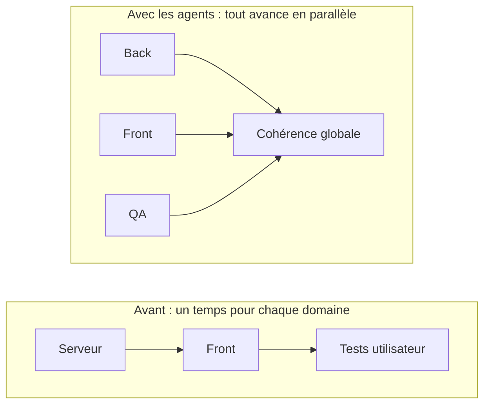

Quand j’opérais en full stack il y a quelques années, il y avait un temps pour
tout, un découpage temporel qui permettait de mobiliser sa concentration sur un
domaine particulier : le serveur, le front ou les tests _utilisateur_.

Comme l’agent sait très bien coder et qu’il connaît tous les frameworks,
techniques et langages, on ne peut plus se reposer sur l’expertise limitée qu’on
avait acquise. C’est plus complexe et plus rapide, et on a moins le temps
d’ingérer. Il faut être partout à la fois, passer d’un sujet à l’autre, et quand
on a plusieurs projets en parallèle, c’est encore pire. On devient des
développeurs Snapchat, et à l’usage, c’est assez épuisant.

On peut objecter qu’il faut laisser faire l’agent, qu’il est capable de tenir de
bout en bout un projet. L’expérience que j’en ai est différente : il duplique,
multiplie les variantes d’un même concept, et surtout il est dénué de sens
commun : laisser les agents sans supervision, c’est s’assurer de retrouver un
plat de spaghetti à la fin.

Quand on lui demande de réaliser une fonctionnalité, notre sens commun nous dit
qu’il va réaliser un ensemble de petites actions logiques qui sont la
conséquence de la demande. Mais il ne le sait pas fondamentalement.
L’apprentissage des modèles fait en sorte qu’un agent de codage _sait_ qu’il
doit tester après avoir codé, mais il ne sait pas pourquoi : c’est de
l’apprentissage et non du bon sens. Notre projet, il ne l’a pas appris : tout ce
qui sort du cadre très général de son apprentissage n’est pas acquis pour lui.
Si je lui demande de faire A et que n’importe quel développeur humain sait que A
implique B et C, l’agent, lui, ne le sait pas.

Il existe des techniques, comme faire écrire toutes les spécifications avant de
coder. J’ai essayé, mais c’est très lourd et cela ne marche pas toujours :
l’agent ne peut pas tout anticiper, et on déplace le problème du suivi vers la
planification exhaustive. Cette méthode est connue et elle rappelle fortement le
cycle en V. Elle a montré ses limites pour le développement logiciel par le
passé. Il est peu probable qu’elle fonctionne mieux avec un agent.

Avec des humains qui codent sur un projet maîtrisé, le travail de contrôle
qualité consiste majoritairement à rechercher des oublis, de petites erreurs ou
des cas à la marge. Avec un agent, on est presque certain que tout fonctionne
techniquement sur chaque point pris isolément, mais globalement on peut avoir un
résultat dysfonctionnel et incohérent. Le _globalement_, c’est encore le boulot
du sens commun des développeurs humains.
