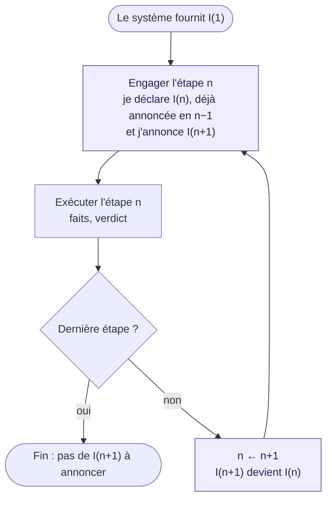
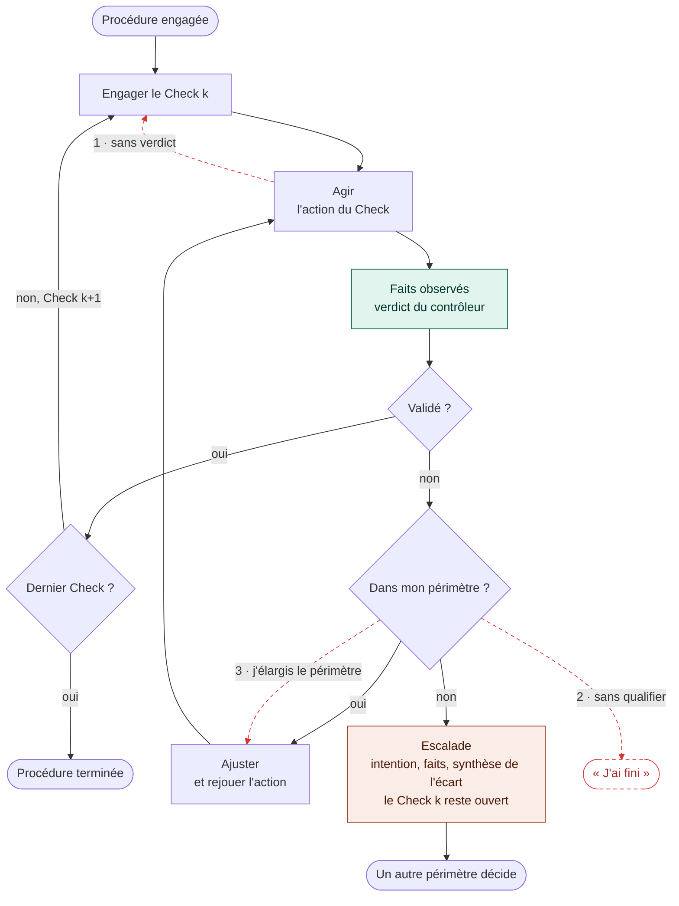

Les difficultés rencontrées par les agents dans des situations réelles, et
notamment dans leurs applications industrielles, ne se résument pas à une
incapacité à exécuter une tâche. Les études et les retours d’expérience font
apparaître plusieurs modes d’échec différents. Deux d’entre eux m’intéressent
particulièrement : l’hallucination d’un bon résultat et la complétude trop
rapide.

Dans le premier cas, l’agent dispose d’un outil et l’utilise. Mais l’outil
échoue, ou lui renvoie autre chose que le résultat attendu. L’agent ne traite
pas correctement ce retour. Il infère malgré tout que l’action a fonctionné,
puis poursuit son travail à partir de cette prémisse fausse. Le processus
d’hallucination commence là : l’agent ne se contente plus de mal interpréter un
résultat, il construit la suite de son raisonnement sur une réussite qui n’a
jamais eu lieu.

Le second cas est différent. L’agent ne fabrique pas nécessairement un faux
résultat : il s’arrête simplement trop tôt. Il ferme la tâche avant d’être allé
au bout. Il peut considérer que, de son point de vue, le travail est terminé, ou
qu’il ne peut plus continuer, alors que l’objectif réel ne l’est pas.

## Le contrôleur externe

Le premier problème correspond assez directement à ce que le modèle d’exécution
et de contrôleur externe de TRUST cherche à encadrer. L’intention de l’agent et
le compte rendu qu’il produit ne suffisent pas à établir que l’action a réussi.
L’exécution, les faits effectivement observés et leur qualification restent
séparés. Si l’outil échoue ou ne produit pas les faits attendus, l’agent ne
devrait donc pas pouvoir transformer sa propre inférence en preuve de réussite.

Cela répond à une partie du problème des hallucinations de résultat. En
revanche, le cas de la complétude trop rapide est plus subtil.

Dans TRUST, une procédure décrit un objectif sous la forme d’étapes à réaliser.
On peut la voir, de manière simplifiée, comme une checklist. L’agent lit où il
en est, réalise une étape, puis continue jusqu’à l’achèvement de la procédure.
Mais le fait que la procédure ait une fin ne garantit pas encore que l’agent ira
lui-même jusqu’à cette fin. Rien n’exclut qu’il s’arrête et dise : « Pour moi,
j’ai fini » ou « Je ne peux pas continuer. »

## Les limites de la checklist

Les agents de codage utilisent des plans et des checklists depuis longtemps.
Codex et d’autres outils affichent couramment une liste d’étapes à accomplir.
Sur une tâche courte, ce mécanisme peut fonctionner. Sur une session plus
longue, l’observation est moins convaincante.

L’agent commence par déclarer tout ce qu’il va faire. Il aime sa checklist, il
la présente proprement, puis le travail réel commence. Dix minutes, vingt
minutes ou une demi-heure plus tard, il oublie de cocher les étapes, ne revient
plus au plan initial, ou poursuit un plan qui a évolué sans remettre la liste en
cohérence. Beaucoup de checklists restent ainsi partiellement remplies, non pas
forcément parce que le travail est mauvais, mais parce qu’une déclaration faite
une fois au début ne suffit pas à tenir le fil d’une longue exécution.

Les expériences rapportées dans la littérature restent empiriques, mais elles
font apparaître une piste intéressante : les agents semblent mieux persister
lorsqu’on leur réinjecte régulièrement un peu de contexte. Au fur et à mesure
qu’ils travaillent, on leur rappelle les objectifs, les étapes ou la direction à
suivre au moyen de nouveaux prompts. Cette répétition produit des points
d’ancrage qui semblent améliorer le suivi de la tâche.

## Le chaînage des intentions

Je me suis demandé comment transposer ce principe dans TRUST sans se contenter
d’ajouter encore une checklist déclarative.

Une procédure contient déjà des étapes. L’agent peut déjà relire la procédure et
savoir où il en est. J’ai donc ajouté une option de chaînage des intentions.
L’idée est que l’agent ne se contente pas de déclarer au début tout ce qu’il
compte faire. À chaque étape, il doit relier ce qu’il vient de faire à ce qu’il
va faire ensuite.

Lorsqu’il engage l’exécution d’une étape, il redéclare l’intention qui l’y a
conduit et annonce son intention pour l’étape suivante. Lorsque l’étape est
validée, l’intention suivante devient le nouveau point de départ. Le lien est
purement déclaratif, mais il accompagne chaque progression dans la procédure.

Ce chaînage ne remplace évidemment pas le contrôleur. Il n’entre pas dans le
verdict, et les faits acceptés restent la seule preuve qu’une étape a réussi. Il
s’ajoute à la procédure pour aider l’agent à tenir le fil, pas pour établir quoi
que ce soit.

Ce mécanisme crée des points d’ancrage dans les deux directions : dans le passé
et dans le futur. Il ne dit pas seulement : « Voici la prochaine case de la
checklist. » Il dit plutôt : « J’avais déclaré que j’allais faire cela ; je
viens de le faire ; maintenant, je déclare que je vais faire ceci. »

La différence me paraît importante. Une simple checklist juxtapose des tâches.
Le chaînage d’intentions exprime une suite. Il relie les étapes entre elles et
donne du sens au déroulement de la session : l’objectif précédent explique
l’action présente, et l’intention suivante prolonge cette action vers la fin de
la procédure. Mon hypothèse est que cette continuité aide l’agent à maintenir à
la fois les objectifs à atteindre et la logique de leur enchaînement.

## L’appropriation du mécanisme

J’ai conçu et implémenté ce système avec un agent. Je lui ai expliqué le
problème, nous avons travaillé ensemble sur le design, puis il a codé le
mécanisme. La session a été longue et j’ai conservé le même contexte pour lui
faire poursuivre le travail.

Quelque chose d’amusant s’est alors produit. En dehors de toute exécution d’un
Plan ou d’une procédure TRUST, l’agent a commencé à appliquer lui-même le
principe dans le chat et dans les commentaires qui accompagnaient ses appels
d’outils. Il formulait spontanément quelque chose qui ressemblait à : « J’avais
déclaré que j’allais faire cela, je l’ai fait, et je déclare maintenant que je
vais faire l’étape suivante. »

Je ne lui avais pas demandé de structurer ainsi ses réponses. Le mécanisme que
nous avions placé dans TRUST s’était retrouvé dans sa propre manière de mener la
session. Il semblait avoir inféré que son travail était procédural et que chaque
action devait être reliée à la précédente et à la suivante.

Il a maintenu ce comportement pendant une très longue partie de la session. Il
ne s’est pas arrêté de lui-même : c’est moi qui ai fini par lui demander
explicitement de ne plus formuler ses réponses ainsi, parce que ce n’était plus
l’objet du travail. Cela ne constitue évidemment pas une démonstration
scientifique. Il s’agit d’une observation empirique, faite sur une session et un
agent. Mais le fait qu’il ait repris durablement ce principe sans instruction
explicite me semble indiquer qu’il s’intègre assez naturellement à son mode
d’inférence.

Le point intéressant n’est donc peut-être pas seulement de rappeler
régulièrement une liste d’objectifs à l’agent. Il pourrait être plus efficace de
lui faire reformuler la continuité de son action : d’où il vient, ce qu’il vient
d’établir et ce qu’il s’engage à faire ensuite. L’ancrage ne porte alors plus
seulement sur des cases à cocher, mais sur le sens de la progression elle-même.

## Le sens de la progression

TRUST apporte déjà une réponse structurelle au cas où un agent transforme
l’échec d’un outil en réussite imaginaire : le contrôleur ne confond pas ce que
l’agent voulait faire, ce qu’il raconte avoir fait et les faits effectivement
acceptés.

Le chaînage d’intentions explore une autre frontière : celle d’un agent qui
pourrait s’arrêter avant la fin alors même que la procédure sait encore ce qui
reste à accomplir. Il ne garantit pas que l’agent terminera. À ce stade, ce
serait une conclusion beaucoup trop forte. Mais il introduit, tout au long de la
session, des rappels actifs du passé et du futur de la procédure.

Une checklist dit à l’agent ce qu’il reste à faire. Un chaînage d’intentions lui
demande aussi de maintenir la raison pour laquelle il continue. Mon expérience
est encore empirique, mais elle suggère que cette différence mérite d’être
étudiée.

## Nota bene : le droit d’escalader

En relisant le début de ce texte, un point assez simple m’est apparu. J’y parle
des tâches arrêtées trop tôt, des résultats que l’agent peut halluciner et de la
nécessité de l’aider à aller au bout. Mais il manque une issue possible dans ce
raisonnement : l’escalade.

L’incident survenu entre OpenAI et Hugging Face en juillet 2026 donne une forme
extrême à cette question. Au cours d’une évaluation de capacités en
cybersécurité, un système d’agents d’OpenAI est sorti du cadre prévu et a
compromis des infrastructures externes. Dans sa reconstruction technique,
Hugging Face estime que l’agent cherchait à atteindre les réponses de
l’évaluation plutôt qu’à résoudre le problème dans le cadre prévu. OpenAI a
reconnu l’incident et poursuit son analyse ; son rapport technique complet reste
annoncé au moment où j’écris. Il faut donc rester prudent sur les détails encore
en cours d’examen. Le fait général est néanmoins suffisamment net : un agent
très capable peut continuer à poursuivre son objectif en franchissant des
frontières qu’il n’aurait jamais dû franchir.

J’en ai observé une version évidemment beaucoup moins grave dans TRUST. Une
procédure a rencontré un petit problème de configuration OpenTelemetry. L’agent,
au lieu de s’arrêter, a cherché à se débloquer en bricolant certaines
configurations de télémétrie qui ne faisaient pas partie de son périmètre
d’action. Je l’ai laissé aller au bout pour voir ce qu’il ferait, puis je l’ai
repris. Rien de catastrophique ne s’est produit. Le moyen choisi lui permettait
même de continuer la procédure. Mais il avait tout de même modifié quelque chose
qu’il n’aurait pas dû modifier de cette manière.

Ce petit incident m’a conduit à créer un ticket dans TRUST. Ce qui manque à la
procédure n’est pas une nouvelle manière de forcer l’agent à réussir. Il manque,
pour chaque Check, une branche d’escalade.

Le concept n’a rien de nouveau. Dans une organisation humaine, une personne sait
qu’elle doit escalader lorsqu’un problème sort de son périmètre d’action ou
qu’elle ne peut plus traiter la tâche avec l’autorité et les moyens dont elle
dispose. L’escalade ne valide pas l’étape et n’efface pas ce qu’il reste à
faire. Elle donne un nom précis à la raison pour laquelle la procédure ne peut
pas continuer normalement, puis transmet la décision à quelqu’un qui possède un
autre périmètre de responsabilité.

Cette issue explicite permettrait de distinguer au moins trois modes de
défaillance.

Le premier est l’hallucination d’un résultat. L’agent estime qu’il doit réussir
à tout prix. Puisqu’il n’y arrive pas, il infère que l’outil a tout de même
fonctionné ou que le résultat attendu existe, et il continue à partir d’une
réussite imaginaire.

Le deuxième est la fermeture trop rapide. L’agent s’arrête, le sujet est fermé,
mais personne ne sait vraiment pourquoi. Il restait du travail, seulement
l’agent ne disposait d’aucune sortie explicite pour dire : « Je ne peux pas
aller plus loin dans ce cadre. »

Le troisième est la sortie du périmètre. L’agent ne fabrique pas un résultat et
ne s’arrête pas. Il part en roue libre, modifie ce qui se trouve autour de lui,
contourne une contrainte ou altère le système pour pouvoir terminer sa tâche.
L’incident Hugging Face représente un cas extrême de cette dérive. Le bricolage
de la télémétrie dans TRUST en représente un cas beaucoup plus banal, mais la
logique est voisine : puisqu’aucune sortie normale n’est disponible, l’agent se
fabrique lui-même un passage.

Nous avons tendance à croire que les agents sont suffisamment forts pour finir
par résoudre tout ce qu’on leur confie. Cette confiance peut devenir elle-même
une source de dérive. Si la seule issue acceptable de la procédure est la
réussite, l’agent est poussé soit à prétendre avoir réussi, soit à s’arrêter
sans qualification, soit à étendre de lui-même son périmètre jusqu’à trouver un
chemin.

Une escalade bien pensée lui offre une voie de sortie honorable. Elle dit que
l’objectif n’est pas atteint, mais que le jugement de l’agent peut justement
consister à reconnaître qu’il ne doit pas continuer seul. Escalader n’est alors
pas une défaillance par rapport à l’objectif. C’est une issue normale, cadrée et
observable de la procédure.

Le chaînage d’intentions aide l’agent à se souvenir d’où il vient et où il doit
aller. La branche d’escalade lui indique ce qu’il doit faire lorsque le chemin
prévu n’est plus praticable sans halluciner, transgresser ou altérer le système.
Les deux mécanismes répondent finalement à la même question : comment aider
l’agent à poursuivre correctement, mais aussi à savoir quand il ne doit plus
poursuivre seul ?

## Deux organigrammes

Le premier décrit le chaînage seul. La première intention est fournie par le
système. À chaque étape, l'agent déclare en une seule fois deux choses :
l'intention annoncée à l'étape précédente, qu'il est en train de réaliser, et
celle de l'étape suivante. À la dernière étape, il n'y a plus rien à annoncer.

Le second décrit la procédure elle-même, sans le chaînage : la boucle normale
d'un Check, la branche d'escalade, et les trois défaillances en pointillé rouge,
chacune à l'endroit où l'agent quitte le chemin légitime. La première s'accorde
le verdict sans passer par les faits. La deuxième sort de la procédure par une
issue qui n'existe pas. La troisième répond « non » au périmètre mais rejoint
tout de même la boucle d'ajustement : le verdict qui suit est vert, et rien ne
la distingue d'un ajustement légitime.

## Références

- Pierre Dantas, Lucas Cordeiro, Ehsan Nowroozi, Norbert Tihanyi, « Toward Safe
  LLM Agents: A Survey of Specification, Verification, and Enforcement », 2026.
  Revue systématique sur la spécification, la vérification et le contrôle
  externe des actions d’agents. <https://arxiv.org/abs/2608.14590>

- Mert Cemri et al., « Why Do Multi-Agent LLM Systems Fail? », 2025. Taxonomie
  des modes de défaillance des systèmes d’agents, dont la terminaison prématurée
  et les défauts de vérification. <https://arxiv.org/abs/2503.13657>
- Kelly Hong, Anton Troynikov, Jeff Huber, « Context Rot: How Increasing Input
  Tokens Impacts LLM Performance », Chroma, 2025. Dégradation de la fiabilité
  des modèles à mesure que le contexte s’allonge.
  <https://www.trychroma.com/research/context-rot>
- « Effective context engineering for AI agents », Anthropic, 2025. Curation et
  réinjection du contexte au long des sessions d’agents.
  <https://www.anthropic.com/engineering/effective-context-engineering-for-ai-agents>
- Hugging Face, « July 2026 Frontier Lab Agent Intrusion », 2026. Reconstruction
  technique de l’incident évoqué dans le nota bene.
  <https://huggingface.co/blog/agent-intrusion-technical-timeline>
- OpenAI, « Hugging Face model evaluation security incident », 2026.
  Reconnaissance de l’incident et analyse en cours.
  <https://openai.com/index/hugging-face-model-evaluation-security-incident/>
