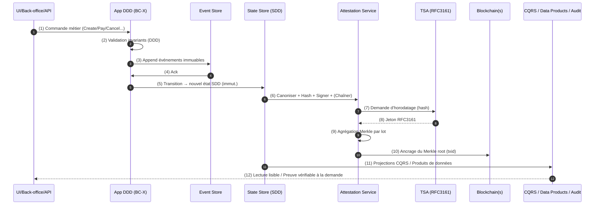

# Architecture cible — DDD/SDD + Blockchain (ancrage de preuve)

> **Objectif** Inscrire le **DDD** (avec **SDD**) dans la stratégie data de l’entreprise et **démontrer sa complémentarité opérationnelle** avec l’ancrage **blockchain** pour la preuve scellée, sans exposer de données sensibles.

---

## 1) Executive summary (à lire au board)

- **Écrire des événements, persister des états, ancrer des preuves.**\
  Commandes → Événements (audit) → **États SDD immuables** (valeur patrimoniale) → **Preuves scellées** (hash + signature + horodatage) → **Ancrage blockchain** (Merkle root) → **Vues CQRS** (valeur métier).
- **Bénéfices** : conformité / audit express, données auto‑explicatives, réduction de la dette, traçabilité hors code, interopérabilité analytique.
- **Politique** : hash public, **jamais** de PII en chaîne.  TSA/eIDAS + HSM + WORM.  KPI : MTTA audit, délai ancrage, taux d’échec preuve.

---

## 2) Schéma — Vue d’ensemble (stratégie → capacités → systèmes)

```mermaid
flowchart TB
  subgraph Strat[Stratégie numérique & Gouvernance]
    GRC[Conformité & Risques\n(GDPR, eIDAS, ISO27001)]
    DG[Data Governance\n(Catalogue, Dictionnaires, SLA)]
    KMS[HSM / KMS & IAM]
  end

  subgraph Biz[Capacités métier]
    BC1[Bounded Context A]
    BC2[Bounded Context B]
    BC3[Bounded Context C]
  end

  subgraph Dom[DDD Application Layer]
    CMD[Commands]
    SVC[Domain Services]
    VAL[Value Objects / Aggregates]
  end

  subgraph Log[Journal & États]
    EVT[(Event Store)]
    SDD[(State Store SDD\nÉtats immuables + transitions)]
  end

  subgraph Proof[Service d'attestation de preuve]
    CAN[Canonisation (JCS/CBOR)]
    HSH[Hash SHA-256]
    SIG[Signature (Ed25519)\n+ kid]
    TSA[Horodatage TSA RFC3161]
    MRK[Merkle Batcher]
  end

  subgraph Chain[Ancrage public]
    BTC[Bitcoin]
    ETH[Ethereum]
  end

  subgraph Read[Lectures & Produits]
    CQRS[Projections CQRS]
    BI[Data Products / BI]
    AUD[Portail Audit]
  end

  Strat --> Biz
  Biz --> Dom
  CMD --> SVC --> VAL --> EVT
  EVT --> SDD
  SDD --> CAN --> HSH --> SIG --> TSA --> MRK --> BTC
  MRK --> ETH
  SDD --> CQRS --> BI
  SDD --> AUD
  KMS --> SIG
  DG --> Read
  GRC --> AUD
```

**Idées clés** :

- La **preuve** vit dans un **service transverse** (canonisation → hash → signature → TSA → Merkle → ancrage).
- Les **systèmes métiers** restent **DDD/SDD-first** ; l’ancrage est un **complément de confiance**.

---

## 3) Schéma — Vue composants & flux (numéroté)



**Points durs traités** :

- Rejeu de projections sans altérer l’historique d’états scellés.
- Non‑répudiation via signature + TSA + ancrage public.
- Zéro PII sur chaîne, seule l’**empreinte** est publique.

---

## 4) Modèle de données (ex. SDD + preuve)

- **États** : `aggregate_id`, `variant`, `payload_json`, `transition`, `valid_from/to`, `prev_state_hash`, `state_hash`, `signature(kid)`, `tsa_token`, `merkle_root`, `anchor_chain`, `anchor_txid`.
- **Journal d’ancrage** : `batch_id`, `window`, `merkle_root`, `chain_id`, `txid`, `status`, `retries`.
- **Clés & signers** : `kid`, `algo`, `cert_chain`, `not_before/after`.

> **Règle** : le hash porte sur une **représentation canonique** de l’état + métadonnées critiques (invariants d’audit).

---

## 5) RACI & Opérabilité

- **Domain Teams (BC)** : DDD/SDD, transitions, invariants, tables d’états, events.
- **Platform/Infra** : HSM/KMS, TSA, connecteurs blockchain, WORM, observabilité, runbooks.
- **Data Office** : dictionnaires, SLA, politiques de rétention/purge (GDPR), preuves d’audit.

**SLO/Monitoring** : latence TSA/ancrage, taux d’échec, temps de reconstitution d’une preuve, drift de projections.

---

## 6) Roadmap d’adoption (90 jours)

1. **Pilote** sur un flux critique à faible cardinalité d’états (ex. Paiement).
2. **Implémenter SDD** (États + transitions nommées) et journal d’événements.
3. **Brancher attestation** (canonisation JCS, SHA‑256, Ed25519 via HSM, TSA).
4. **Batch Merkle + Ancrage** (quotidien, puis horaire si besoin) sur 1–2 chaînes.
5. **Portail audit** : export “package de preuve” (état canonique, hash, signature, TSA, preuve Merkle, txid).
6. **Généraliser** (templates, lib interne, checklist conformité) aux autres BC.

---

## 7) Décisions à trancher (gouvernance)

- **Cadence d’ancrage** (J/H/événement majeur) & chaînes cibles (mono vs multi‑chaînes).
- **Algorithmes** : JCS/CBOR canoniques ; SHA‑256 ; Ed25519 ; RFC3161.
- **Périmètre PII** : tokenisation/chiffrement au repos ; hash d’engagement sans PII.
- **SLA audit** : MTTA pour produire une preuve; conservation WORM; plan de reprise.

---

## 8) Message clé (stratégie)

> **Le DDD/SDD rend l’état explicite, stable et patrimonial.**\
> **La blockchain lui apporte un sceau public et infalsifiable.**\
> Ensemble, ils transforment la donnée métier en **actif vérifiable** et **avantage concurrentiel**.

